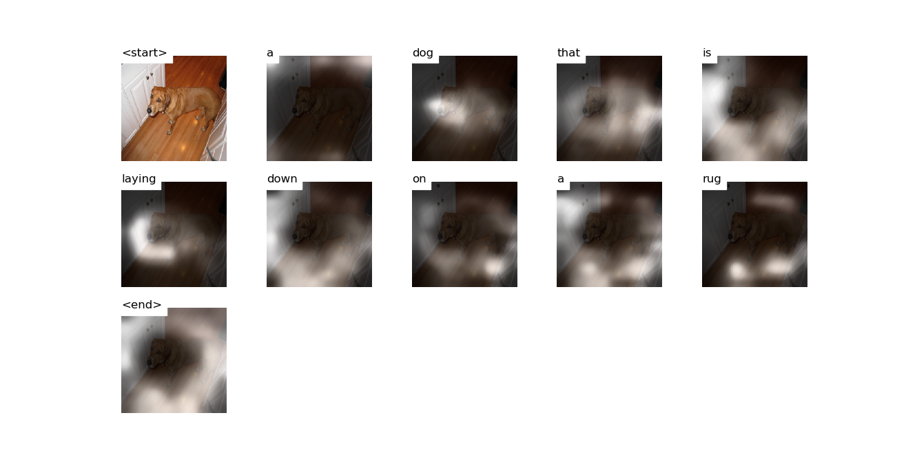

# Attention


# Decoding Beam (k=5)
```
['<start>', 'a'] 				 Score: -0.2508106231689453
['<start>', 'two'] 				 Score: -2.636340856552124
['<start>', 'the'] 				 Score: -3.119985342025757
['<start>', 'an'] 				 Score: -3.89092755317688
['<start>', 'there'] 				 Score: -4.057015419006348


['<start>', 'a', 'dog'] 				 Score: -1.1863794326782227
['<start>', 'a', 'large'] 				 Score: -2.6081817150115967
['<start>', 'two', 'dogs'] 				 Score: -3.0159242153167725
['<start>', 'a', 'man'] 				 Score: -3.2897279262542725
['<start>', 'a', 'cat'] 				 Score: -3.3055665493011475


['<start>', 'a', 'dog', 'laying'] 				 Score: -2.586754322052002
['<start>', 'a', 'dog', 'is'] 				 Score: -2.5990467071533203
['<start>', 'a', 'large', 'dog'] 				 Score: -3.1143267154693604
['<start>', 'a', 'dog', 'that'] 				 Score: -4.071582794189453
['<start>', 'a', 'dog', 'lying'] 				 Score: -4.244071960449219


['<start>', 'a', 'dog', 'laying', 'on'] 				 Score: -2.9354562759399414
['<start>', 'a', 'dog', 'is', 'laying'] 				 Score: -3.708754539489746
['<start>', 'a', 'dog', 'is', 'sleeping'] 				 Score: -3.7770915031433105
['<start>', 'a', 'dog', 'that', 'is'] 				 Score: -4.178783416748047
['<start>', 'a', 'large', 'dog', 'laying'] 				 Score: -4.44429874420166


['<start>', 'a', 'dog', 'laying', 'on', 'a'] 				 Score: -3.263472557067871
['<start>', 'a', 'dog', 'is', 'laying', 'on'] 				 Score: -4.071772575378418
['<start>', 'a', 'dog', 'is', 'sleeping', 'on'] 				 Score: -4.122726917266846
['<start>', 'a', 'dog', 'that', 'is', 'laying'] 				 Score: -4.6383442878723145
['<start>', 'a', 'large', 'dog', 'laying', 'on'] 				 Score: -4.660996437072754


['<start>', 'a', 'dog', 'laying', 'on', 'a', 'bed'] 				 Score: -4.308787822723389
['<start>', 'a', 'dog', 'is', 'laying', 'on', 'a'] 				 Score: -4.379254341125488
['<start>', 'a', 'dog', 'is', 'sleeping', 'on', 'a'] 				 Score: -4.438618183135986
['<start>', 'a', 'large', 'dog', 'laying', 'on', 'a'] 				 Score: -5.074457168579102
['<start>', 'a', 'dog', 'laying', 'on', 'a', 'couch'] 				 Score: -5.144595146179199


['<start>', 'a', 'dog', 'laying', 'on', 'a', 'bed', 'with'] 				 Score: -5.299993515014648
['<start>', 'a', 'dog', 'is', 'laying', 'on', 'a', 'bed'] 				 Score: -5.846863269805908
['<start>', 'a', 'dog', 'laying', 'on', 'a', 'bed', 'next'] 				 Score: -5.923713684082031
['<start>', 'a', 'dog', 'is', 'sleeping', 'on', 'a', 'bed'] 				 Score: -6.105772972106934
['<start>', 'a', 'dog', 'laying', 'on', 'a', 'couch', 'with'] 				 Score: -6.205914497375488


['<start>', 'a', 'dog', 'laying', 'on', 'a', 'bed', 'with', 'a'] 				 Score: -5.815547466278076
['<start>', 'a', 'dog', 'laying', 'on', 'a', 'bed', 'next', 'to'] 				 Score: -5.924084663391113
['<start>', 'a', 'dog', 'laying', 'on', 'a', 'couch', 'with', 'a'] 				 Score: -6.8227763175964355
['<start>', 'a', 'dog', 'is', 'laying', 'on', 'a', 'bed', 'with'] 				 Score: -6.829896926879883
['<start>', 'a', 'dog', 'is', 'sleeping', 'on', 'a', 'bed', 'with'] 				 Score: -6.950482368469238


['<start>', 'a', 'dog', 'laying', 'on', 'a', 'bed', 'next', 'to', 'a'] 				 Score: -6.094372272491455
['<start>', 'a', 'dog', 'is', 'laying', 'on', 'a', 'bed', 'with', 'a'] 				 Score: -7.5180206298828125
['<start>', 'a', 'dog', 'is', 'sleeping', 'on', 'a', 'bed', 'with', 'a'] 				 Score: -7.586177825927734
['<start>', 'a', 'dog', 'laying', 'on', 'a', 'bed', 'with', 'a', 'red'] 				 Score: -7.66477632522583
['<start>', 'a', 'dog', 'laying', 'on', 'a', 'bed', 'with', 'a', 'blanket'] 				 Score: -8.341280937194824


['<start>', 'a', 'dog', 'laying', 'on', 'a', 'bed', 'next', 'to', 'a', 'dog'] 				 Score: -8.633465766906738
['<start>', 'a', 'dog', 'laying', 'on', 'a', 'bed', 'with', 'a', 'red', 'blanket'] 				 Score: -8.685956954956055
['<start>', 'a', 'dog', 'laying', 'on', 'a', 'bed', 'next', 'to', 'a', 'pillow'] 				 Score: -8.753364562988281
['<start>', 'a', 'dog', 'laying', 'on', 'a', 'bed', 'with', 'a', 'blanket', '<end>'] 				 Score: -9.059595108032227
['<start>', 'a', 'dog', 'laying', 'on', 'a', 'bed', 'next', 'to', 'a', 'large'] 				 Score: -9.079294204711914


['<start>', 'a', 'dog', 'laying', 'on', 'a', 'bed', 'next', 'to', 'a', 'dog', '<end>'] 				 Score: -8.734222412109375
['<start>', 'a', 'dog', 'laying', 'on', 'a', 'bed', 'next', 'to', 'a', 'pillow', '<end>'] 				 Score: -8.82579231262207
['<start>', 'a', 'dog', 'laying', 'on', 'a', 'bed', 'with', 'a', 'red', 'blanket', '<end>'] 				 Score: -8.893169403076172
['<start>', 'a', 'dog', 'laying', 'on', 'a', 'bed', 'next', 'to', 'a', 'large', 'dog'] 				 Score: -10.577775955200195


['<start>', 'a', 'dog', 'laying', 'on', 'a', 'bed', 'next', 'to', 'a', 'large', 'dog', '<end>'] 				 Score: -10.77614688873291
```