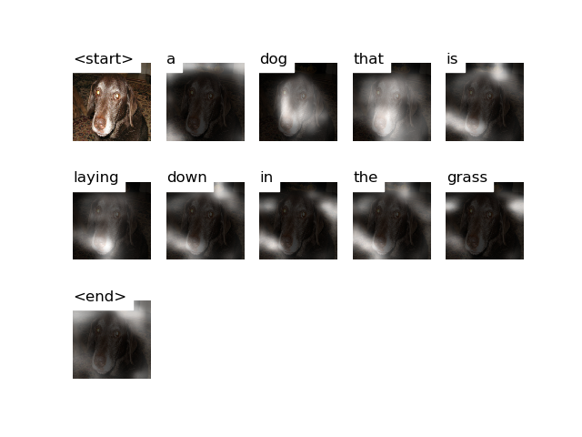

# Attention


# Decoding Beam (k=5)
```
['<start>', 'a'] 				 Score: -0.23932170867919922
['<start>', 'two'] 				 Score: -2.697922468185425
['<start>', 'the'] 				 Score: -3.037146806716919
['<start>', 'an'] 				 Score: -3.9325809478759766
['<start>', 'there'] 				 Score: -4.070312023162842


['<start>', 'a', 'dog'] 				 Score: -0.6679816246032715
['<start>', 'a', 'black'] 				 Score: -2.9970412254333496
['<start>', 'two', 'dogs'] 				 Score: -3.001553773880005
['<start>', 'the', 'dog'] 				 Score: -3.366312265396118
['<start>', 'a', 'small'] 				 Score: -3.3981266021728516


['<start>', 'a', 'dog', 'is'] 				 Score: -2.0624730587005615
['<start>', 'a', 'dog', 'with'] 				 Score: -2.7434446811676025
['<start>', 'a', 'black', 'dog'] 				 Score: -3.0980911254882812
['<start>', 'a', 'dog', 'looks'] 				 Score: -3.2779083251953125
['<start>', 'a', 'dog', 'that'] 				 Score: -3.3589625358581543


['<start>', 'a', 'dog', 'with', 'a'] 				 Score: -2.9991424083709717
['<start>', 'a', 'dog', 'that', 'is'] 				 Score: -3.625537395477295
['<start>', 'a', 'dog', 'is', 'sitting'] 				 Score: -4.041150093078613
['<start>', 'a', 'dog', 'is', 'looking'] 				 Score: -4.090361595153809
['<start>', 'a', 'dog', 'is', 'laying'] 				 Score: -4.1943039894104


['<start>', 'a', 'dog', 'is', 'looking', 'at'] 				 Score: -4.875010013580322
['<start>', 'a', 'dog', 'that', 'is', 'sitting'] 				 Score: -5.040036678314209
['<start>', 'a', 'dog', 'that', 'is', 'laying'] 				 Score: -5.055252552032471
['<start>', 'a', 'dog', 'is', 'sitting', 'in'] 				 Score: -5.095027923583984
['<start>', 'a', 'dog', 'is', 'laying', 'on'] 				 Score: -5.161537170410156


['<start>', 'a', 'dog', 'that', 'is', 'laying', 'down'] 				 Score: -5.488572597503662
['<start>', 'a', 'dog', 'is', 'looking', 'at', 'the'] 				 Score: -5.620026111602783
['<start>', 'a', 'dog', 'is', 'laying', 'on', 'the'] 				 Score: -5.688612461090088
['<start>', 'a', 'dog', 'is', 'sitting', 'in', 'the'] 				 Score: -5.749189376831055
['<start>', 'a', 'dog', 'that', 'is', 'sitting', 'in'] 				 Score: -6.018106460571289


['<start>', 'a', 'dog', 'is', 'looking', 'at', 'the', 'camera'] 				 Score: -5.660486698150635
['<start>', 'a', 'dog', 'that', 'is', 'laying', 'down', 'in'] 				 Score: -6.3841753005981445
['<start>', 'a', 'dog', 'is', 'laying', 'on', 'the', 'floor'] 				 Score: -6.48463773727417
['<start>', 'a', 'dog', 'is', 'laying', 'on', 'the', 'ground'] 				 Score: -6.511714935302734
['<start>', 'a', 'dog', 'that', 'is', 'sitting', 'in', 'the'] 				 Score: -6.827752113342285


['<start>', 'a', 'dog', 'that', 'is', 'laying', 'down', 'in', 'the'] 				 Score: -6.766663551330566
['<start>', 'a', 'dog', 'is', 'looking', 'at', 'the', 'camera', 'while'] 				 Score: -6.944536209106445
['<start>', 'a', 'dog', 'is', 'looking', 'at', 'the', 'camera', 'with'] 				 Score: -7.376141548156738
['<start>', 'a', 'dog', 'is', 'looking', 'at', 'the', 'camera', 'in'] 				 Score: -7.571183681488037
['<start>', 'a', 'dog', 'that', 'is', 'laying', 'down', 'in', 'a'] 				 Score: -7.740963935852051


['<start>', 'a', 'dog', 'is', 'looking', 'at', 'the', 'camera', 'with', 'a'] 				 Score: -7.770218849182129
['<start>', 'a', 'dog', 'that', 'is', 'laying', 'down', 'in', 'the', 'grass'] 				 Score: -8.218451499938965
['<start>', 'a', 'dog', 'is', 'looking', 'at', 'the', 'camera', 'while', 'sitting'] 				 Score: -8.42322826385498
['<start>', 'a', 'dog', 'is', 'looking', 'at', 'the', 'camera', 'in', 'the'] 				 Score: -8.520313262939453
['<start>', 'a', 'dog', 'is', 'looking', 'at', 'the', 'camera', 'in', 'a'] 				 Score: -8.662054061889648


['<start>', 'a', 'dog', 'that', 'is', 'laying', 'down', 'in', 'the', 'grass', '<end>'] 				 Score: -8.250771522521973
['<start>', 'a', 'dog', 'is', 'looking', 'at', 'the', 'camera', 'while', 'sitting', 'on'] 				 Score: -8.969639778137207
['<start>', 'a', 'dog', 'is', 'looking', 'at', 'the', 'camera', 'in', 'a', 'room'] 				 Score: -9.636918067932129
['<start>', 'a', 'dog', 'is', 'looking', 'at', 'the', 'camera', 'while', 'sitting', 'in'] 				 Score: -9.868030548095703
['<start>', 'a', 'dog', 'is', 'looking', 'at', 'the', 'camera', 'with', 'a', 'toy'] 				 Score: -10.088491439819336


['<start>', 'a', 'dog', 'is', 'looking', 'at', 'the', 'camera', 'while', 'sitting', 'on', 'a'] 				 Score: -9.345125198364258
['<start>', 'a', 'dog', 'is', 'looking', 'at', 'the', 'camera', 'in', 'a', 'room', '<end>'] 				 Score: -9.677206039428711
['<start>', 'a', 'dog', 'is', 'looking', 'at', 'the', 'camera', 'while', 'sitting', 'in', 'a'] 				 Score: -10.206443786621094
['<start>', 'a', 'dog', 'is', 'looking', 'at', 'the', 'camera', 'while', 'sitting', 'on', 'the'] 				 Score: -10.31889533996582


['<start>', 'a', 'dog', 'is', 'looking', 'at', 'the', 'camera', 'while', 'sitting', 'in', 'a', 'chair'] 				 Score: -10.59375
['<start>', 'a', 'dog', 'is', 'looking', 'at', 'the', 'camera', 'while', 'sitting', 'on', 'the', 'floor'] 				 Score: -10.598012924194336
['<start>', 'a', 'dog', 'is', 'looking', 'at', 'the', 'camera', 'while', 'sitting', 'on', 'a', 'carpet'] 				 Score: -10.683405876159668


['<start>', 'a', 'dog', 'is', 'looking', 'at', 'the', 'camera', 'while', 'sitting', 'in', 'a', 'chair', '<end>'] 				 Score: -10.632266998291016
['<start>', 'a', 'dog', 'is', 'looking', 'at', 'the', 'camera', 'while', 'sitting', 'on', 'the', 'floor', '<end>'] 				 Score: -10.63595199584961
['<start>', 'a', 'dog', 'is', 'looking', 'at', 'the', 'camera', 'while', 'sitting', 'on', 'a', 'carpet', '<end>'] 				 Score: -10.712976455688477
```
# Scores for alternatives of the top 5 sentences

These examples show the scores for artificially created sentences that incorporate descriptions of colour. 

```
a dog that is laying down in the grass 	        Score: -8.250770568847656
a brown dog that is laying down in the grass 	Score: -14.98491096496582
a black dog that is laying down in the grass 	Score: -11.933735847473145
a blue dog that is laying down in the grass 	Score: -19.23875617980957
a white dog that is laying down in the grass 	Score: -15.423270225524902
a grey dog that is laying down in the grass 	Score: -16.999141693115234
a green dog that is laying down in the grass 	Score: -17.972122192382812

a dog is looking at the camera in a room 	    Score: -9.677206993103027
a brown dog is looking at the camera in a room 	Score: -17.28998565673828
a black dog is looking at the camera in a room 	Score: -14.42463207244873
a blue dog is looking at the camera in a room 	Score: -21.52858543395996
a white dog is looking at the camera in a room 	Score: -17.109485626220703
a grey dog is looking at the camera in a room 	Score: -18.51006317138672
a green dog is looking at the camera in a room 	Score: -20.706439971923828

a dog is looking at the camera while sitting in a chair 	    Score: -10.632266998291016
a brown dog is looking at the camera while sitting in a chair 	Score: -18.61996841430664
a black dog is looking at the camera while sitting in a chair 	Score: -15.645105361938477
a blue dog is looking at the camera while sitting in a chair 	Score: -22.995162963867188
a white dog is looking at the camera while sitting in a chair 	Score: -18.2467041015625
a grey dog is looking at the camera while sitting in a chair 	Score: -19.546621322631836
a green dog is looking at the camera while sitting in a chair 	Score: -22.02511215209961

a dog is looking at the camera while sitting on the floor 	        Score: -10.63595199584961
a brown dog is looking at the camera while sitting on the floor 	Score: -18.455581665039062
a black dog is looking at the camera while sitting on the floor 	Score: -15.501049041748047
a blue dog is looking at the camera while sitting on the floor 	    Score: -22.585922241210938
a white dog is looking at the camera while sitting on the floor 	Score: -18.043853759765625
a grey dog is looking at the camera while sitting on the floor 	    Score: -19.436594009399414
a green dog is looking at the camera while sitting on the floor 	Score: -21.62759780883789

a dog is looking at the camera while sitting on a carpet 	    Score: -10.712980270385742
a brown dog is looking at the camera while sitting on a carpet 	Score: -18.275360107421875
a black dog is looking at the camera while sitting on a carpet 	Score: -15.422399520874023
a blue dog is looking at the camera while sitting on a carpet 	Score: -22.59923553466797
a white dog is looking at the camera while sitting on a carpet 	Score: -17.992198944091797
a grey dog is looking at the camera while sitting on a carpet 	Score: -19.545663833618164
a green dog is looking at the camera while sitting on a carpet 	Score: -21.586528778076172
```