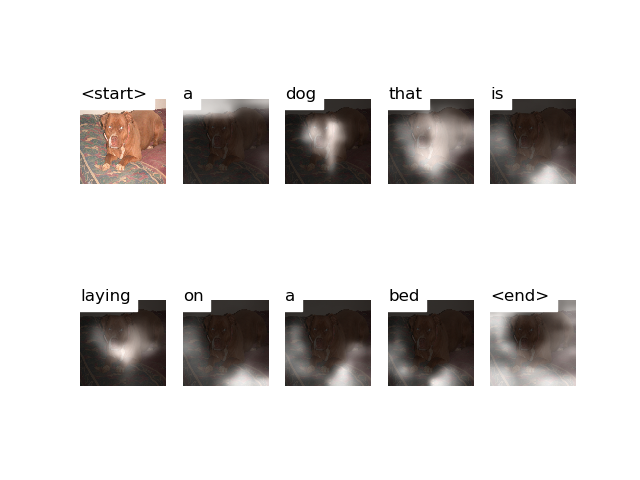

# Attention


# Decoding Beam (k=5)
```
['<start>', 'a'] 				 Score: -0.2562565803527832
['<start>', 'two'] 				 Score: -2.7694573402404785
['<start>', 'the'] 				 Score: -3.0475449562072754
['<start>', 'an'] 				 Score: -3.6219871044158936
['<start>', 'there'] 				 Score: -4.003644943237305


['<start>', 'a', 'dog'] 				 Score: -0.8681435585021973
['<start>', 'a', 'large'] 				 Score: -2.8133108615875244
['<start>', 'two', 'dogs'] 				 Score: -3.0709333419799805
['<start>', 'the', 'dog'] 				 Score: -3.64724063873291
['<start>', 'a', 'small'] 				 Score: -3.886864185333252


['<start>', 'a', 'dog', 'is'] 				 Score: -2.358541488647461
['<start>', 'a', 'dog', 'laying'] 				 Score: -2.5804367065429688
['<start>', 'a', 'dog', 'with'] 				 Score: -3.183568239212036
['<start>', 'a', 'dog', 'that'] 				 Score: -3.3749890327453613
['<start>', 'a', 'large', 'dog'] 				 Score: -3.593101739883423


['<start>', 'a', 'dog', 'laying', 'on'] 				 Score: -2.8124237060546875
['<start>', 'a', 'dog', 'is', 'laying'] 				 Score: -3.258289337158203
['<start>', 'a', 'dog', 'that', 'is'] 				 Score: -3.5228095054626465
['<start>', 'a', 'dog', 'with', 'a'] 				 Score: -3.5331127643585205
['<start>', 'a', 'dog', 'is', 'sleeping'] 				 Score: -4.074334144592285


['<start>', 'a', 'dog', 'laying', 'on', 'a'] 				 Score: -3.129629135131836
['<start>', 'a', 'dog', 'is', 'laying', 'on'] 				 Score: -3.521056652069092
['<start>', 'a', 'dog', 'that', 'is', 'laying'] 				 Score: -4.102524280548096
['<start>', 'a', 'dog', 'is', 'sleeping', 'on'] 				 Score: -4.285069465637207
['<start>', 'a', 'dog', 'laying', 'on', 'top'] 				 Score: -4.753462791442871


['<start>', 'a', 'dog', 'is', 'laying', 'on', 'a'] 				 Score: -3.817716598510742
['<start>', 'a', 'dog', 'laying', 'on', 'a', 'bed'] 				 Score: -4.135902404785156
['<start>', 'a', 'dog', 'is', 'sleeping', 'on', 'a'] 				 Score: -4.546767234802246
['<start>', 'a', 'dog', 'laying', 'on', 'top', 'of'] 				 Score: -4.756333351135254
['<start>', 'a', 'dog', 'that', 'is', 'laying', 'on'] 				 Score: -4.805745601654053


['<start>', 'a', 'dog', 'laying', 'on', 'top', 'of', 'a'] 				 Score: -4.799437999725342
['<start>', 'a', 'dog', 'that', 'is', 'laying', 'on', 'a'] 				 Score: -5.026342868804932
['<start>', 'a', 'dog', 'is', 'laying', 'on', 'a', 'bed'] 				 Score: -5.13656759262085
['<start>', 'a', 'dog', 'laying', 'on', 'a', 'bed', 'with'] 				 Score: -5.175191879272461
['<start>', 'a', 'dog', 'is', 'sleeping', 'on', 'a', 'bed'] 				 Score: -5.988507270812988


['<start>', 'a', 'dog', 'laying', 'on', 'top', 'of', 'a', 'bed'] 				 Score: -5.53788423538208
['<start>', 'a', 'dog', 'that', 'is', 'laying', 'on', 'a', 'bed'] 				 Score: -5.654538154602051
['<start>', 'a', 'dog', 'laying', 'on', 'a', 'bed', 'with', 'a'] 				 Score: -5.762629508972168
['<start>', 'a', 'dog', 'is', 'laying', 'on', 'a', 'bed', 'with'] 				 Score: -6.269554138183594
['<start>', 'a', 'dog', 'is', 'sleeping', 'on', 'a', 'bed', 'with'] 				 Score: -7.069803237915039


['<start>', 'a', 'dog', 'that', 'is', 'laying', 'on', 'a', 'bed', '<end>'] 				 Score: -5.760050296783447
['<start>', 'a', 'dog', 'laying', 'on', 'top', 'of', 'a', 'bed', '<end>'] 				 Score: -6.660642623901367
['<start>', 'a', 'dog', 'is', 'laying', 'on', 'a', 'bed', 'with', 'a'] 				 Score: -6.988567352294922
['<start>', 'a', 'dog', 'laying', 'on', 'a', 'bed', 'with', 'a', 'red'] 				 Score: -6.996667861938477
['<start>', 'a', 'dog', 'laying', 'on', 'top', 'of', 'a', 'bed', 'with'] 				 Score: -7.152719020843506


['<start>', 'a', 'dog', 'laying', 'on', 'top', 'of', 'a', 'bed', 'with', 'a'] 				 Score: -7.6058502197265625
['<start>', 'a', 'dog', 'laying', 'on', 'a', 'bed', 'with', 'a', 'red', 'blanket'] 				 Score: -7.855495452880859
['<start>', 'a', 'dog', 'is', 'laying', 'on', 'a', 'bed', 'with', 'a', 'red'] 				 Score: -8.352313041687012


['<start>', 'a', 'dog', 'laying', 'on', 'a', 'bed', 'with', 'a', 'red', 'blanket', '<end>'] 				 Score: -8.004378318786621
['<start>', 'a', 'dog', 'is', 'laying', 'on', 'a', 'bed', 'with', 'a', 'red', 'blanket'] 				 Score: -9.101768493652344
['<start>', 'a', 'dog', 'laying', 'on', 'top', 'of', 'a', 'bed', 'with', 'a', 'red'] 				 Score: -9.115218162536621


['<start>', 'a', 'dog', 'is', 'laying', 'on', 'a', 'bed', 'with', 'a', 'red', 'blanket', '<end>'] 				 Score: -9.135421752929688
['<start>', 'a', 'dog', 'laying', 'on', 'top', 'of', 'a', 'bed', 'with', 'a', 'red', 'blanket'] 				 Score: -9.673118591308594


['<start>', 'a', 'dog', 'laying', 'on', 'top', 'of', 'a', 'bed', 'with', 'a', 'red', 'blanket', '<end>'] 				 Score: -9.7327880859375
```