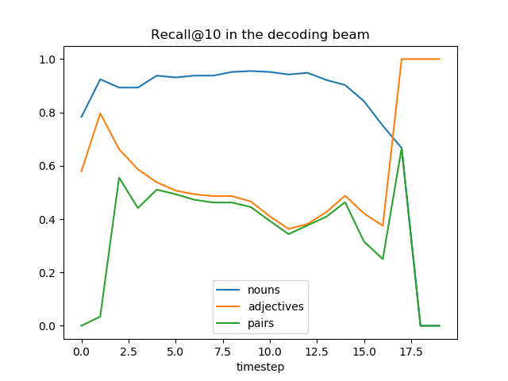
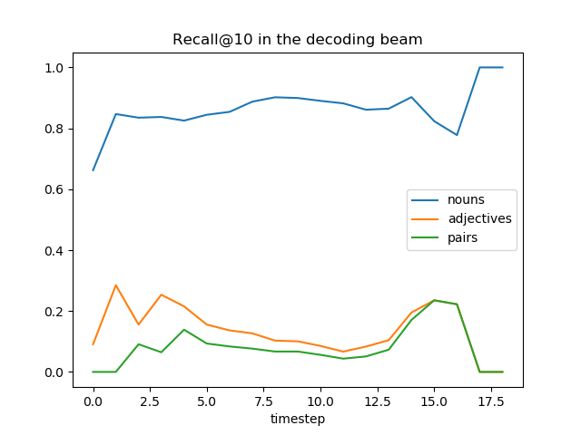

# Experiments

## 1. Generalisation Capabilities

**Research Question: How well do Multimodal Neural Language Models (MNLMs) generalise to unseen
Adjective-Noun (Adj-N) pairs?**

All images of the COCO dataset were annotated with information about how often a specific adjective-noun pair
combination occurs in the corresponding captions. 

Subsets of the COCO training set were created by removing all samples where a specific adjective-noun pair occurs at
least once in the caption. For each of the training sets, a model was trained. 

For the evaluation, data from the COCO validation set was annotated in the same way. This time, only samples that where
the adjective-noun pair occurs are added to the test set.

Notes on how to interpret the results:
- "Recall (n>=1)" stands for the recall of the respective adjective noun pair,
where n of the target captions contain the adjective noun pair.
- For a beam size of n, the top n sentences are produced. If at least one of the sentences contains the target
adjective-noun pair, the sample is counted as true positive (i.e. we are calculating the recall@n)

### Bottom Up and Top Down Attention

BLEU-4 baseline (karpathy splits): 0.342

#### Model trained with held out "brown dog"

Performance on held out test set ("brown dog"):

Beam size | BLEU-4 | Recall (n>=1) | Recall (n>=2) | Recall (n>=3) | Recall (n>=4) | Recall (n>=5)
----------|--------| --------------| --------------| --------------| --------------| -------------
1         | 0.313  | 0.003         | 0             | 0             | 0             | N/A
5         | 0.318  | 0.041         | 0.057         | 0.067         | 0             | N/A

Performance on "white car" data:

Beam size | BLEU-4 | Recall (n>=1) | Recall (n>=2) | Recall (n>=3) | Recall (n>=4) | Recall (n>=5)
----------|--------| --------------| --------------| --------------| --------------| -------------
1         | 0.266  | 0.187         | 0.262         | 0.342         | 0.375         | N/A
5         | 0.264  | 0.380         | 0.476         | 0.632         | 0.75          | N/A

Performance on "big car" data:

Beam size | BLEU-4 | Recall (n>=1) | Recall (n>=2) | Recall (n>=3) | Recall (n>=4) | Recall (n>=5)
----------|--------| --------------| --------------| --------------| --------------| -------------
1         | 0.283  | 0.055         | 0.144         | 0.231         | 0.5           | N/A
5         | 0.321  | 0.154         | 0.304         | 0.538         | 0.5           | N/A

#### Model trained with held out "white car"

Performance on held out test set ("white car"):

Beam size | BLEU-4 | Recall (n>=1) | Recall (n>=2) | Recall (n>=3) | Recall (n>=4) | Recall (n>=5)
----------|--------| --------------| --------------| --------------| --------------| -------------
1         | 0.271  | 0.045         | 0.063         | 0.053         | 0             | N/A
5         | 0.262  | 0.045         | 0.063         | 0.132         | 0             | N/A

Performance on "brown dog" data:

Beam size | BLEU-4 | Recall (n>=1) | Recall (n>=2) | Recall (n>=3) | Recall (n>=4) | Recall (n>=5)
----------|--------| --------------| --------------| --------------| --------------| -------------
1         | 0.308  | 0.0724        | 0.115         | 0.267         | 0             | N/A                                                                                                                                                                                                                                                                                                                                                                                                                                                                                                                                                                                                                                                                                                                                                                                                                                                                                                                                                                                                                                                                                                                                                                                                                                                                                                                                                                                                                                                                                                                                                                                                                                                                                                                                                                                                                                                                                                                                                                                                                                                                                                                                                                                                                                                                                                                                                                                                                                                                                                                                                                                                                                                                                                                                                                                                                                                                                                                                                                                                                                                                                                                                                                                                                                                                                                                                                                                                                                                                                                                                                                                                                                                                                                                                                                                                                                                                                                                                                                                                                                                                                                                                                                                                                                                                                                                                                                                                                                                                                                                                                                                                                                                                                                                                                                                                                                                                                                                                                                                                                                            
5         | 0.359  | 0.334         | 0.402         | 0.533         | 0             | N/A

Performance on "big car" data:

Beam size | BLEU-4 | Recall (n>=1) | Recall (n>=2) | Recall (n>=3) | Recall (n>=4) | Recall (n>=5)
----------|--------| --------------| --------------| --------------| --------------| -------------
1         | 0.282  | 0.093         | 0.168         | 0.15384615    | 0             | N/A
5         | 0.299  | 0.136         | 0.256         | 0.346         | 1             | N/A

#### Model trained with held out "big car"

Performance on held out test set ("big car"):

Beam size | BLEU-4 | Recall (n>=1) | Recall (n>=2) | Recall (n>=3) | Recall (n>=4) | Recall (n>=5)
----------|--------| --------------| --------------| --------------| --------------| -------------
1         | 0.264  | 0.002         | 0.008         | 0.038         | 0             | N/A
5         | 0.311  | 0             | 0             | 0             | 0             | N/A

Performance on "brown dog" data:

Beam size | BLEU-4 | Recall (n>=1) | Recall (n>=2) | Recall (n>=3) | Recall (n>=4) | Recall (n>=5)
----------|--------| --------------| --------------| --------------| --------------| -------------
1         | 0.329  | 0.031         | 0.023         | 0             | 0             | N/A
5         | 0.357  | 0.341         | 0.414         | 0.6           | 0             | N/A

Performance on "white car" data:

Beam size | BLEU-4 | Recall (n>=1) | Recall (n>=2) | Recall (n>=3) | Recall (n>=4) | Recall (n>=5)
----------|--------| --------------| --------------| --------------| --------------| -------------
1         | 0.282  | 0.222         | 0.302         | 0.316         | 0.375         | N/A
5         | 0.303  | 0.380         | 0.516         | 0.605         | 0.625         | N/A

#### Beam Occurrences

**Occurrences of "brown dog"**

Model trained with heldout brown dog:

Model trained with heldout white car:

**Occurrences of "white car"**

Model trained with heldout white car:

Model trained with heldout brown dog:

