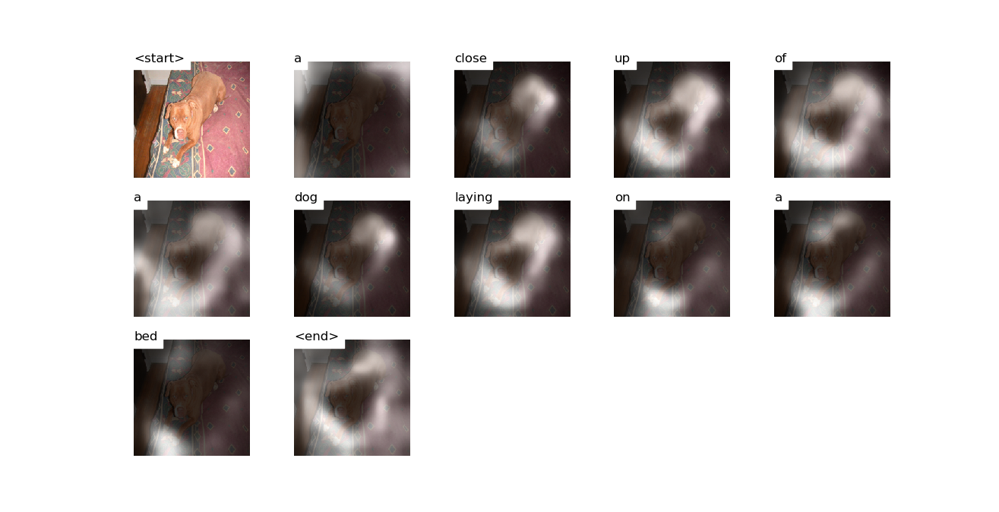

# Case study
Image COCO ID: 51369

## Attention


## Decoding Beam (k=5)
```
<start>', 'a'] 				 Score: -0.18935823440551758
['<start>', 'the'] 				 Score: -3.1585545539855957
['<start>', 'two'] 				 Score: -3.3845760822296143
['<start>', 'an'] 				 Score: -3.6942501068115234
['<start>', 'there'] 				 Score: -4.307114601135254


['<start>', 'a', 'dog'] 				 Score: -1.76179838180542
['<start>', 'a', 'large'] 				 Score: -2.3394837379455566
['<start>', 'a', 'brown'] 				 Score: -2.5229687690734863
['<start>', 'a', 'close'] 				 Score: -3.143709659576416
['<start>', 'a', 'small'] 				 Score: -3.1845223903656006


['<start>', 'a', 'dog', 'laying'] 				 Score: -2.8223938941955566
['<start>', 'a', 'close', 'up'] 				 Score: -3.159595012664795
['<start>', 'a', 'brown', 'and'] 				 Score: -3.167922019958496
['<start>', 'a', 'small', 'dog'] 				 Score: -3.422814130783081
['<start>', 'a', 'dog', 'is'] 				 Score: -3.6303110122680664


['<start>', 'a', 'dog', 'laying', 'on'] 				 Score: -3.153299331665039
['<start>', 'a', 'close', 'up', 'of'] 				 Score: -3.172321319580078
['<start>', 'a', 'brown', 'and', 'black'] 				 Score: -3.7376441955566406
['<start>', 'a', 'dog', 'is', 'laying'] 				 Score: -4.2813520431518555
['<start>', 'a', 'brown', 'and', 'white'] 				 Score: -4.6517486572265625


['<start>', 'a', 'close', 'up', 'of', 'a'] 				 Score: -3.361569881439209
['<start>', 'a', 'dog', 'laying', 'on', 'a'] 				 Score: -3.513423442840576
['<start>', 'a', 'brown', 'and', 'black', 'dog'] 				 Score: -3.828457832336426
['<start>', 'a', 'brown', 'and', 'white', 'dog'] 				 Score: -4.810207366943359
['<start>', 'a', 'dog', 'is', 'laying', 'on'] 				 Score: -4.8337554931640625


['<start>', 'a', 'close', 'up', 'of', 'a', 'dog'] 				 Score: -3.7588720321655273
['<start>', 'a', 'dog', 'laying', 'on', 'a', 'bed'] 				 Score: -3.9589390754699707
['<start>', 'a', 'brown', 'and', 'black', 'dog', 'laying'] 				 Score: -4.594822883605957
['<start>', 'a', 'dog', 'is', 'laying', 'on', 'a'] 				 Score: -5.251429080963135
['<start>', 'a', 'brown', 'and', 'white', 'dog', 'laying'] 				 Score: -5.50142765045166


['<start>', 'a', 'close', 'up', 'of', 'a', 'dog', 'laying'] 				 Score: -4.202846050262451
['<start>', 'a', 'dog', 'laying', 'on', 'a', 'bed', 'with'] 				 Score: -4.510862827301025
['<start>', 'a', 'brown', 'and', 'black', 'dog', 'laying', 'on'] 				 Score: -4.864132881164551
['<start>', 'a', 'brown', 'and', 'white', 'dog', 'laying', 'on'] 				 Score: -5.704084396362305
['<start>', 'a', 'close', 'up', 'of', 'a', 'dog', 'sleeping'] 				 Score: -6.045900821685791


['<start>', 'a', 'close', 'up', 'of', 'a', 'dog', 'laying', 'on'] 				 Score: -4.358212947845459
['<start>', 'a', 'dog', 'laying', 'on', 'a', 'bed', 'with', 'a'] 				 Score: -4.96453857421875
['<start>', 'a', 'brown', 'and', 'black', 'dog', 'laying', 'on', 'a'] 				 Score: -5.213033199310303
['<start>', 'a', 'brown', 'and', 'white', 'dog', 'laying', 'on', 'a'] 				 Score: -6.021426200866699
['<start>', 'a', 'close', 'up', 'of', 'a', 'dog', 'sleeping', 'on'] 				 Score: -6.210880756378174


['<start>', 'a', 'close', 'up', 'of', 'a', 'dog', 'laying', 'on', 'a'] 				 Score: -4.543200969696045
['<start>', 'a', 'brown', 'and', 'black', 'dog', 'laying', 'on', 'a', 'bed'] 				 Score: -6.087355613708496
['<start>', 'a', 'close', 'up', 'of', 'a', 'dog', 'sleeping', 'on', 'a'] 				 Score: -6.329487323760986
['<start>', 'a', 'dog', 'laying', 'on', 'a', 'bed', 'with', 'a', 'red'] 				 Score: -6.517353057861328
['<start>', 'a', 'close', 'up', 'of', 'a', 'dog', 'laying', 'on', 'top'] 				 Score: -6.8031229972839355


['<start>', 'a', 'close', 'up', 'of', 'a', 'dog', 'laying', 'on', 'a', 'bed'] 				 Score: -4.88557767868042
['<start>', 'a', 'close', 'up', 'of', 'a', 'dog', 'laying', 'on', 'a', 'couch'] 				 Score: -6.6181440353393555
['<start>', 'a', 'close', 'up', 'of', 'a', 'dog', 'sleeping', 'on', 'a', 'bed'] 				 Score: -6.754588603973389
['<start>', 'a', 'close', 'up', 'of', 'a', 'dog', 'laying', 'on', 'top', 'of'] 				 Score: -6.803642749786377
['<start>', 'a', 'brown', 'and', 'black', 'dog', 'laying', 'on', 'a', 'bed', 'with'] 				 Score: -7.024004936218262


['<start>', 'a', 'close', 'up', 'of', 'a', 'dog', 'laying', 'on', 'a', 'bed', '<end>'] 				 Score: -5.12698221206665
['<start>', 'a', 'close', 'up', 'of', 'a', 'dog', 'laying', 'on', 'a', 'couch', '<end>'] 				 Score: -6.800714492797852
['<start>', 'a', 'close', 'up', 'of', 'a', 'dog', 'sleeping', 'on', 'a', 'bed', '<end>'] 				 Score: -6.819624423980713
['<start>', 'a', 'close', 'up', 'of', 'a', 'dog', 'laying', 'on', 'top', 'of', 'a'] 				 Score: -6.834367275238037
['<start>', 'a', 'close', 'up', 'of', 'a', 'dog', 'laying', 'on', 'a', 'bed', 'with'] 				 Score: -6.9174299240112305


['<start>', 'a', 'close', 'up', 'of', 'a', 'dog', 'laying', 'on', 'top', 'of', 'a', 'bed'] 				 Score: -7.170036315917969
['<start>', 'a', 'close', 'up', 'of', 'a', 'dog', 'laying', 'on', 'a', 'bed', 'with', 'a'] 				 Score: -7.400803565979004


['<start>', 'a', 'close', 'up', 'of', 'a', 'dog', 'laying', 'on', 'top', 'of', 'a', 'bed', '<end>'] 				 Score: -7.253246307373047
['<start>', 'a', 'close', 'up', 'of', 'a', 'dog', 'laying', 'on', 'a', 'bed', 'with', 'a', 'red'] 				 Score: -9.082813262939453


['<start>', 'a', 'close', 'up', 'of', 'a', 'dog', 'laying', 'on', 'a', 'bed', 'with', 'a', 'red', 'blanket'] 				 Score: -9.526208877563477


['<start>', 'a', 'close', 'up', 'of', 'a', 'dog', 'laying', 'on', 'a', 'bed', 'with', 'a', 'red', 'blanket', '<end>'] 				 Score: -9.607108116149902
```
## Scores for alternatives of the top 5 sentences

These examples show the scores for artificially created sentences that incorporate descriptions of colour. 

```
a close up of a dog laying on a bed 	Score: -5.126984119415283
a close up of a brown dog laying on a bed 	Score: -8.904020309448242
a close up of a black dog laying on a bed 	Score: -9.591466903686523
a close up of a white dog laying on a bed 	Score: -11.879497528076172
a close up of a blue dog laying on a bed 	Score: -13.894083976745605
a close up of a red dog laying on a bed 	Score: -11.18918228149414
```