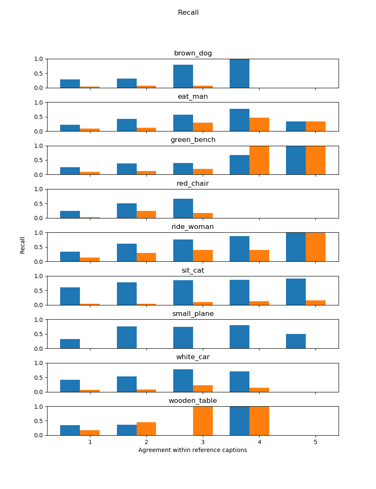

# Bottom-Up Ranking Generation

We design a network for a multi-task scenario: The first objective is to learn visual-semantic embeddings for
cross-modal retrieval. The second objective is to generate captions for a given image. As image features, the
pre-trained features from the Bottom-Up-Top-Down model are used.

## Training with ranking objective

Recall@5 for the target pair when ranking the whole coco validation set (40504 samples):

Pair | Recall (n>=1) | Recall (n>=2) | Recall (n>=3) | Recall (n>=4) | Recall (n>=5)
----------| --------------| --------------| --------------| --------------| -------------
brown_dog | 0.37 | 0.43 | 0.57 | 1.0 | N/A | 
eat_man | 0.26 | 0.58 | 0.68 | 0.77 | 0.33 | 
green_bench | 0.5 | 0.5 | 0.4 | 0.67 | 1.0 | 
red_chair | 0.24 | 0.5 | 0.67 | N/A | N/A | 
ride_woman | 0.36 | 0.67 | 0.79 | 0.73 | 1.0 | 
sit_cat | 0.62 | 0.79 | 0.88 | 0.91 | 0.91 | 
small_plane | 0.39 | 0.76 | 0.81 | 0.8 | 0.5 | 
white_car | 0.3 | 0.51 | 0.55 | 1.0 | N/A | 
wooden_table | 0.12 | 0.45 | 0.0 | 1.0 | N/A |

## Training with joint objective (added losses)
Generation performance:

Beam size 1:

Pair | Recall (n=1) | Recall (n=2) | Recall (n=3) | Recall (n=4) | Recall (n=5)
-----|--------------| -------------| -------------| -------------| -----------
brown_dog | 0.01 | 0.03 | 0.0 | 0.0 | N/A | 
eat_man | 0.03 | 0.09 | 0.12 | 0.23 | 0.33 | 
green_bench | 0.05 | 0.0 | 0.2 | 0.33 | 0.0 | 
red_chair | 0.03 | 0.25 | 0.17 | N/A | N/A | 
ride_woman | 0.05 | 0.11 | 0.15 | 0.4 | 0.33 | 
sit_cat | 0.01 | 0.03 | 0.05 | 0.08 | 0.09 | 
small_plane | 0.0 | 0.0 | 0.0 | 0.0 | 0.0 | 
white_car | 0.01 | 0.0 | 0.06 | 0.0 | N/A | 
wooden_table | 0.0 | 0.0 | 0.0 | 0.0 | N/A |

Beam size 5:

Pair | Recall (n=1) | Recall (n=2) | Recall (n=3) | Recall (n=4) | Recall (n=5)
-----|--------------| -------------| -------------| -------------| -----------
brown_dog | 0.05 | 0.04 | 0.14 | 0.0 | N/A | 
eat_man | 0.05 | 0.09 | 0.15 | 0.23 | 0.0 | 
green_bench | 0.15 | 0.0 | 0.0 | 0.33 | 0.0 | 
red_chair | 0.14 | 0.5 | 0.33 | N/A | N/A | 
ride_woman | 0.11 | 0.22 | 0.18 | 0.4 | 0.33 | 
sit_cat | 0.03 | 0.06 | 0.09 | 0.14 | 0.16 | 
small_plane | 0.0 | 0.0 | 0.0 | 0.0 | 0.0 | 
white_car | 0.05 | 0.08 | 0.23 | 0.14 | N/A | 
wooden_table | 0.11 | 0.18 | 0.0 | 0.0 | N/A |

## First train on ranking objective, then on generation objective
Beam size 1:

Pair | Recall (n=1) | Recall (n=2) | Recall (n=3) | Recall (n=4) | Recall (n=5)
-----|--------------| -------------| -------------| -------------| -----------
brown_dog | 0.0 | 0.03 | 0.0 | 0.0 | N/A | 
eat_man | 0.09 | 0.21 | 0.12 | 0.46 | 0.67 | 
green_bench | 0.05 | 0.0 | 0.2 | 0.67 | 0.0 | 
red_chair | 0.1 | 0.25 | 0.17 | N/A | N/A | 
ride_woman | 0.02 | 0.11 | 0.18 | 0.33 | 0.67 | 
sit_cat | 0.01 | 0.04 | 0.06 | 0.08 | 0.12 | 
small_plane | 0.0 | 0.0 | 0.0 | 0.0 | 0.0 | 
white_car | 0.04 | 0.03 | 0.16 | 0.14 | N/A | 
wooden_table | 0.0 | 0.0 | 0.0 | 0.0 | N/A |

Beam size 5:

Pair | Recall (n=1) | Recall (n=2) | Recall (n=3) | Recall (n=4) | Recall (n=5)
-----|--------------| -------------| -------------| -------------| -----------
brown_dog | 0.03 | 0.03 | 0.07 | 0.0 | N/A | 
eat_man | 0.12 | 0.23 | 0.18 | 0.46 | 0.0 | 
green_bench | 0.1 | 0.12 | 0.0 | 0.67 | 1.0 | 
red_chair | 0.21 | 0.25 | 0.33 | N/A | N/A | 
ride_woman | 0.07 | 0.22 | 0.3 | 0.53 | 0.67 | 
sit_cat | 0.04 | 0.07 | 0.13 | 0.1 | 0.23 | 
small_plane | 0.0 | 0.0 | 0.0 | 0.0 | 0.0 | 
white_car | 0.08 | 0.08 | 0.23 | 0.29 | N/A | 
wooden_table | 0.12 | 0.18 | 0.0 | 0.0 | N/A |

## First train on ranking objective, then on generation objective with frozen embedding weights

Beam size 1:

Pair | Recall (n=1) | Recall (n=2) | Recall (n=3) | Recall (n=4) | Recall (n=5)
-----|--------------| -------------| -------------| -------------| -----------
brown_dog | 0.01 | 0.03 | 0.07 | 0.0 | N/A | 
eat_man | 0.06 | 0.19 | 0.24 | 0.38 | 0.33 | 
green_bench | 0.0 | 0.0 | 0.2 | 0.33 | 0.0 | 
red_chair | 0.03 | 0.25 | 0.0 | N/A | N/A | 
ride_woman | 0.05 | 0.14 | 0.21 | 0.27 | 0.33 | 
sit_cat | 0.03 | 0.07 | 0.08 | 0.07 | 0.09 | 
small_plane | 0.0 | 0.0 | 0.0 | 0.0 | 0.0 | 
white_car | 0.04 | 0.06 | 0.1 | 0.14 | N/A | 
wooden_table | 0.0 | 0.0 | 0.0 | 0.0 | N/A |

Beam size 5:

Pair | Recall (n=1) | Recall (n=2) | Recall (n=3) | Recall (n=4) | Recall (n=5)
-----|--------------| -------------| -------------| -------------| -----------
brown_dog | 0.02 | 0.04 | 0.0 | 0.0 | N/A | 
eat_man | 0.12 | 0.13 | 0.29 | 0.46 | 0.33 | 
green_bench | 0.0 | 0.0 | 0.0 | 0.33 | 0.0 | 
red_chair | 0.07 | 0.0 | 0.17 | N/A | N/A | 
ride_woman | 0.11 | 0.25 | 0.27 | 0.2 | 0.67 | 
sit_cat | 0.08 | 0.14 | 0.18 | 0.22 | 0.35 | 
small_plane | 0.0 | 0.0 | 0.0 | 0.0 | 0.0 | 
white_car | 0.04 | 0.07 | 0.03 | 0.14 | N/A | 
wooden_table | 0.06 | 0.09 | 0.0 | 1.0 | N/A |

## First train on ranking objective, then on joint objective (added losses)

Beam size 1:

Pair | Recall (n=1) | Recall (n=2) | Recall (n=3) | Recall (n=4) | Recall (n=5)
-----|--------------| -------------| -------------| -------------| -----------
brown_dog | 0.0 | 0.01 | 0.0 | 0.0 | N/A | 
eat_man | 0.08 | 0.13 | 0.29 | 0.38 | 0.33 | 
green_bench | 0.05 | 0.0 | 0.0 | 0.67 | 0.0 | 
red_chair | 0.03 | 0.0 | 0.33 | N/A | N/A | 
ride_woman | 0.1 | 0.23 | 0.33 | 0.33 | 1.0 | 
sit_cat | 0.02 | 0.01 | 0.03 | 0.01 | 0.02 | 
small_plane | 0.0 | 0.0 | 0.0 | 0.0 | 0.0 | 
white_car | 0.03 | 0.01 | 0.23 | 0.0 | N/A | 
wooden_table | 0.0 | 0.0 | 0.0 | 0.0 | N/A |

Beam size 5:

Pair | Recall (n=1) | Recall (n=2) | Recall (n=3) | Recall (n=4) | Recall (n=5)
-----|--------------| -------------| -------------| -------------| -----------
brown_dog | 0.04 | 0.06 | 0.07 | 0.0 | N/A | 
eat_man | 0.09 | 0.11 | 0.29 | 0.46 | 0.33 | 
green_bench | 0.1 | 0.12 | 0.2 | 1.0 | 1.0 | 
red_chair | 0.03 | 0.25 | 0.17 | N/A | N/A | 
ride_woman | 0.14 | 0.3 | 0.39 | 0.4 | 1.0 | 
sit_cat | 0.04 | 0.04 | 0.1 | 0.12 | 0.16 | 
small_plane | 0.0 | 0.0 | 0.0 | 0.0 | 0.0 | 
white_car | 0.06 | 0.08 | 0.23 | 0.14 | N/A | 
wooden_table | 0.17 | 0.45 | 1.0 | 1.0 | N/A |

Comparison with Bottom-Up-Top-Down model trained without heldout pairs:

