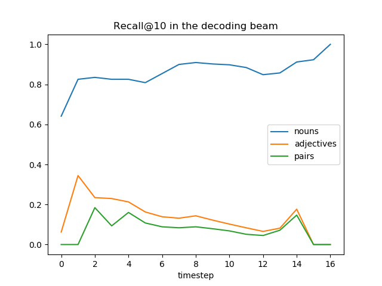
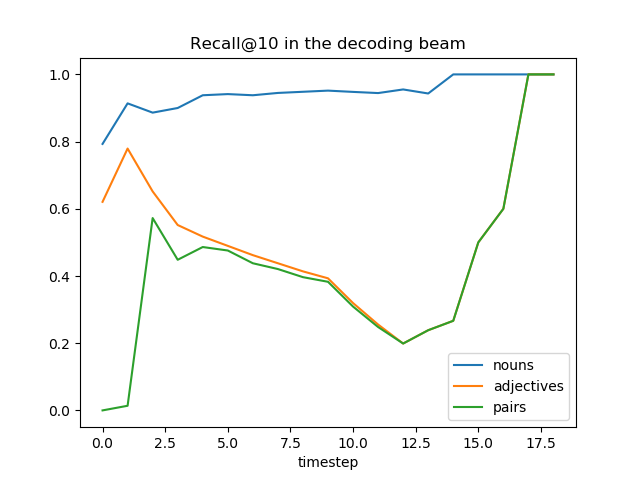
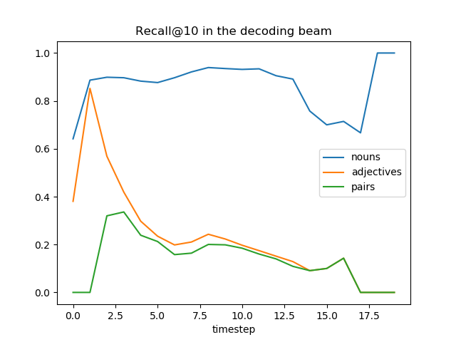
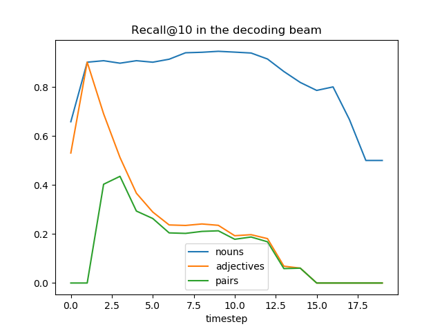

# Pretrained Embeddings

We initialize the decoder of the Bottom Up and Top Down Attention Model with the 300 dimensional
[GloVe embeddings](https://nlp.stanford.edu/projects/glove/), which are pretrained on Wikipedia 2014 and Gigaword 5.
These embeddings are not further fine-tuned. 

## Model trained with held out "white car"

(similar results were observed in a second run)

Performance on held out test set ("white car"):

Beam size | Recall (n>=1) | Recall (n>=2) | Recall (n>=3) | Recall (n>=4) | Recall (n>=5)
----------| --------------| --------------| --------------| --------------| -------------
1         | 0.038         | 0.071         | 0.132         | 0.125         | N/A
5         | 0.079         | 0.135         | 0.263         | 0.25          | N/A

Performance on "brown dog" data:

Beam size | Recall (n>=1) | Recall (n>=2) | Recall (n>=3) | Recall (n>=4) | Recall (n>=5)
----------| --------------| --------------| --------------| --------------| -------------
1         | 0.048         | 0.057         | 0.133         | 0             | N/A
5         | 0.338         | 0.425         | 0.667         | 1             | N/A

Performance on "big car" data:

Beam size | Recall (n>=1) | Recall (n>=2) | Recall (n>=3) | Recall (n>=4) | Recall (n>=5)
----------| --------------| --------------| --------------| --------------| -------------
1         | 0.032         | 0.056         | 0.077         | 0             | N/A
5         | 0.065         | 0.096         | 0.154         | 0             | N/A

Performance on "wooden table" data:

Beam size | Recall (n>=1) | Recall (n>=2) | Recall (n>=3) | Recall (n>=4) | Recall (n>=5)
----------| --------------| --------------| --------------| --------------| -------------
1         | 0.19          | 0.385         | 0             | 0             | N/A
5         | 0.457         | 0.692         | 0.5           | 1             | N/A

## Model trained with held out "brown dog"

Performance on held out test set ("brown dog"):

Beam size | Recall (n>=1) | Recall (n>=2) | Recall (n>=3) | Recall (n>=4) | Recall (n>=5)
----------| --------------| --------------| --------------| --------------| -------------
1         | 0.014         | 0.011         | 0             | 0             | N/A
5         | 0.034         | 0.035         | 0             | 0             | N/A

Second run:

Beam size | Recall (n>=1) | Recall (n>=2) | Recall (n>=3) | Recall (n>=4) | Recall (n>=5)
----------| --------------| --------------| --------------| --------------| -------------
1         | 0.041         | 0.080         | 0.067         | 0             | N/A
5         | 0.131         | 0.172         | 0.267         | 0             | N/A

Third run:

Beam size | Recall (n>=1) | Recall (n>=2) | Recall (n>=3) | Recall (n>=4) | Recall (n>=5)
----------| --------------| --------------| --------------| --------------| -------------
1         | 0.003         | 0             | 0             | 0             | N/A
5         | 0.017         | 0.023         | 0             | 0             | N/A

Performance on "white car" data:

Beam size | Recall (n>=1) | Recall (n>=2) | Recall (n>=3) | Recall (n>=4) | Recall (n>=5)
----------| --------------| --------------| --------------| --------------| -------------
1         | 0.179         | 0.269         | 0.395         | 0.5           | N/A
5         | 0.383         | 0.492         | 0.632         | 0.625         | N/A

Performance on "big car" data:

Beam size | Recall (n>=1) | Recall (n>=2) | Recall (n>=3) | Recall (n>=4) | Recall (n>=5)
----------| --------------| --------------| --------------| --------------| -------------
1         | 0.085         | 0.168         | 0.269         | 0             | N/A
5         | 0.123         | 0.208         | 0.423         | 0.5           | N/A

## Model trained with held out "big car"

(similar results were observed in a second run)

Performance on held out test set ("big car"):

Beam size | Recall (n>=1) | Recall (n>=2) | Recall (n>=3) | Recall (n>=4) | Recall (n>=5)
----------| --------------| --------------| --------------| --------------| -------------
1         | 0.004         | 0             | 0             | 0             | N/A
5         | 0.004         | 0.008         | 0.038         | 0             | N/A

Performance on "white car" data:

Beam size | Recall (n>=1) | Recall (n>=2) | Recall (n>=3) | Recall (n>=4) | Recall (n>=5)
----------| --------------| --------------| --------------| --------------| -------------
1         | 0.199         | 0.309         | 0.395         | 0.625         | N/A
5         | 0.395         | 0.587         | 0.711         | 0.75          | N/A

Performance on "small dog" data:

Beam size | Recall (n>=1) | Recall (n>=2) | Recall (n>=3) | Recall (n>=4) | Recall (n>=5)
----------| --------------| --------------| --------------| --------------| -------------
1         | 0.063         | 0.08          | 0.167         | 0.294         | 0.5
5         | 0.174         | 0.241         | 0.333         | 0.529         | 1.0

## Model trained with held out "small dog"

Performance on held out test set ("small dog"):

Beam size | Recall (n>=1) | Recall (n>=2) | Recall (n>=3) | Recall (n>=4) | Recall (n>=5)
----------| --------------| --------------| --------------| --------------| -------------
1         | 0             | 0             | 0             | 0             | 0
5         | 0.003         | 0.009         | 0.024         | 0.059         | 0

## Model trained with held out "wooden table"

Performance on held out test set ("wooden table"):

Beam size | Recall (n>=1) | Recall (n>=2) | Recall (n>=3) | Recall (n>=4) | Recall (n>=5)
----------| --------------| --------------| --------------| --------------| -------------
1         | 0             | 0             | 0             | 0             | N/A
5         | 0.241         | 0.462         | 0             | 0             | N/A

# Pretrained embeddings for both input and output layer

## Model trained with held out "big car"

Performance on held out test set ("big car"):

Beam size | Recall (n>=1) | Recall (n>=2) | Recall (n>=3) | Recall (n>=4) | Recall (n>=5)
----------| --------------| --------------| --------------| --------------| -------------
1         | 0.006         | 0.008         | 0.038         | 0.5           | N/A
5         | 0             | 0             | 0             | 0             | N/A
