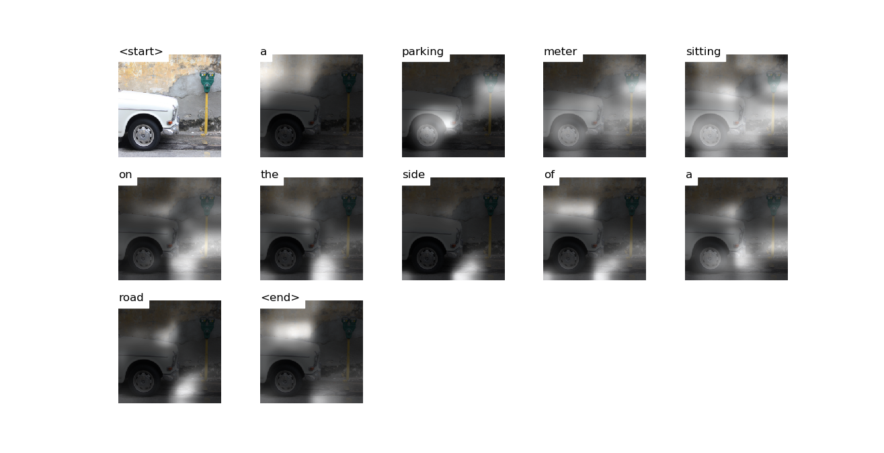

# Attention


# Decoding Beam (k=5)
```
['<start>', 'a'] 				 Score: -0.2590498924255371
['<start>', 'the'] 				 Score: -2.911771774291992
['<start>', 'an'] 				 Score: -3.1897523403167725
['<start>', 'two'] 				 Score: -3.4134750366210938
['<start>', 'there'] 				 Score: -3.9291934967041016


['<start>', 'a', 'parking'] 				 Score: -1.7080531120300293
['<start>', 'a', 'car'] 				 Score: -2.463651657104492
['<start>', 'a', 'black'] 				 Score: -2.8273003101348877
['<start>', 'a', 'blue'] 				 Score: -2.9789514541625977
['<start>', 'an', 'old'] 				 Score: -3.653301477432251


['<start>', 'a', 'parking', 'meter'] 				 Score: -1.7141222953796387
['<start>', 'a', 'black', 'and'] 				 Score: -3.4521305561065674
['<start>', 'a', 'car', 'parked'] 				 Score: -4.098812580108643
['<start>', 'a', 'blue', 'and'] 				 Score: -4.134538650512695
['<start>', 'a', 'blue', 'car'] 				 Score: -4.3103203773498535


['<start>', 'a', 'parking', 'meter', 'with'] 				 Score: -3.5077502727508545
['<start>', 'a', 'parking', 'meter', 'is'] 				 Score: -3.5517873764038086
['<start>', 'a', 'black', 'and', 'white'] 				 Score: -3.9337475299835205
['<start>', 'a', 'parking', 'meter', 'on'] 				 Score: -4.028858184814453
['<start>', 'a', 'parking', 'meter', 'sitting'] 				 Score: -4.0302734375


['<start>', 'a', 'parking', 'meter', 'with', 'a'] 				 Score: -3.9450700283050537
['<start>', 'a', 'black', 'and', 'white', 'parking'] 				 Score: -4.109657287597656
['<start>', 'a', 'parking', 'meter', 'on', 'a'] 				 Score: -4.661195278167725
['<start>', 'a', 'parking', 'meter', 'sitting', 'on'] 				 Score: -4.896549224853516
['<start>', 'a', 'parking', 'meter', 'on', 'the'] 				 Score: -4.970084190368652


['<start>', 'a', 'black', 'and', 'white', 'parking', 'meter'] 				 Score: -4.12735652923584
['<start>', 'a', 'parking', 'meter', 'sitting', 'on', 'the'] 				 Score: -5.229070663452148
['<start>', 'a', 'parking', 'meter', 'on', 'the', 'side'] 				 Score: -5.526920795440674
['<start>', 'a', 'parking', 'meter', 'on', 'a', 'sidewalk'] 				 Score: -5.541989326477051
['<start>', 'a', 'parking', 'meter', 'with', 'a', 'parking'] 				 Score: -6.113816261291504


['<start>', 'a', 'parking', 'meter', 'sitting', 'on', 'the', 'side'] 				 Score: -5.28758430480957
['<start>', 'a', 'parking', 'meter', 'on', 'the', 'side', 'of'] 				 Score: -5.5374579429626465
['<start>', 'a', 'black', 'and', 'white', 'parking', 'meter', 'with'] 				 Score: -5.684292793273926
['<start>', 'a', 'black', 'and', 'white', 'parking', 'meter', 'on'] 				 Score: -5.900241374969482
['<start>', 'a', 'parking', 'meter', 'with', 'a', 'parking', 'meter'] 				 Score: -6.246509552001953


['<start>', 'a', 'parking', 'meter', 'sitting', 'on', 'the', 'side', 'of'] 				 Score: -5.290184020996094
['<start>', 'a', 'parking', 'meter', 'on', 'the', 'side', 'of', 'a'] 				 Score: -5.984721660614014
['<start>', 'a', 'black', 'and', 'white', 'parking', 'meter', 'with', 'a'] 				 Score: -6.327739715576172
['<start>', 'a', 'black', 'and', 'white', 'parking', 'meter', 'on', 'a'] 				 Score: -6.484432220458984
['<start>', 'a', 'parking', 'meter', 'on', 'the', 'side', 'of', 'the'] 				 Score: -6.64790153503418


['<start>', 'a', 'parking', 'meter', 'sitting', 'on', 'the', 'side', 'of', 'a'] 				 Score: -5.502074718475342
['<start>', 'a', 'parking', 'meter', 'on', 'the', 'side', 'of', 'a', 'road'] 				 Score: -6.431599140167236
['<start>', 'a', 'parking', 'meter', 'on', 'the', 'side', 'of', 'the', 'road'] 				 Score: -6.856062889099121
['<start>', 'a', 'parking', 'meter', 'sitting', 'on', 'the', 'side', 'of', 'the'] 				 Score: -7.028689861297607
['<start>', 'a', 'parking', 'meter', 'on', 'the', 'side', 'of', 'a', 'street'] 				 Score: -7.373071193695068


['<start>', 'a', 'parking', 'meter', 'sitting', 'on', 'the', 'side', 'of', 'a', 'road'] 				 Score: -5.740489482879639
['<start>', 'a', 'parking', 'meter', 'on', 'the', 'side', 'of', 'a', 'road', '<end>'] 				 Score: -7.060253143310547
['<start>', 'a', 'parking', 'meter', 'sitting', 'on', 'the', 'side', 'of', 'the', 'road'] 				 Score: -7.138604640960693
['<start>', 'a', 'parking', 'meter', 'on', 'the', 'side', 'of', 'the', 'road', '<end>'] 				 Score: -7.349546432495117
['<start>', 'a', 'parking', 'meter', 'sitting', 'on', 'the', 'side', 'of', 'a', 'street'] 				 Score: -7.421223163604736


['<start>', 'a', 'parking', 'meter', 'sitting', 'on', 'the', 'side', 'of', 'a', 'road', '<end>'] 				 Score: -5.931291103363037
['<start>', 'a', 'parking', 'meter', 'sitting', 'on', 'the', 'side', 'of', 'the', 'road', '<end>'] 				 Score: -7.306560039520264
['<start>', 'a', 'parking', 'meter', 'sitting', 'on', 'the', 'side', 'of', 'a', 'street', '<end>'] 				 Score: -7.58404016494751
```