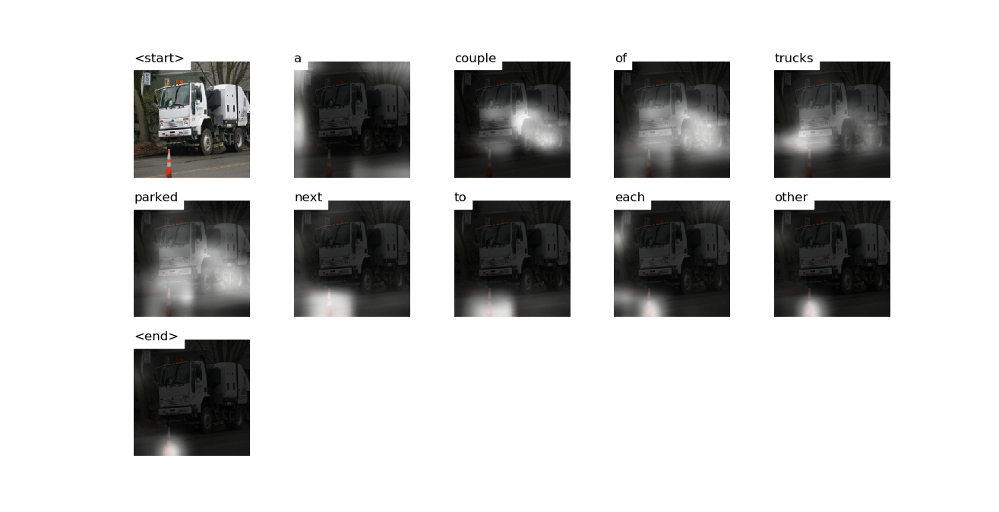

# Attention


# Decoding Beam (k=5)
```
['<start>', 'a'] 				 Score: -0.28374719619750977
['<start>', 'two'] 				 Score: -2.820374011993408
['<start>', 'the'] 				 Score: -2.9566802978515625
['<start>', 'an'] 				 Score: -3.4215660095214844
['<start>', 'there'] 				 Score: -3.9882194995880127


['<start>', 'a', 'car'] 				 Score: -1.60520339012146
['<start>', 'a', 'truck'] 				 Score: -2.484675407409668
['<start>', 'a', 'small'] 				 Score: -3.1681442260742188
['<start>', 'a', 'white'] 				 Score: -3.4419455528259277
['<start>', 'a', 'man'] 				 Score: -3.617577075958252


['<start>', 'a', 'car', 'is'] 				 Score: -3.027022361755371
['<start>', 'a', 'car', 'parked'] 				 Score: -3.5855016708374023
['<start>', 'a', 'small', 'car'] 				 Score: -3.901308536529541
['<start>', 'a', 'car', 'that'] 				 Score: -3.927382230758667
['<start>', 'a', 'car', 'with'] 				 Score: -3.9804179668426514


['<start>', 'a', 'car', 'is', 'parked'] 				 Score: -3.496126174926758
['<start>', 'a', 'car', 'that', 'is'] 				 Score: -4.180922508239746
['<start>', 'a', 'car', 'with', 'a'] 				 Score: -4.287200927734375
['<start>', 'a', 'car', 'parked', 'on'] 				 Score: -4.632437705993652
['<start>', 'a', 'car', 'parked', 'in'] 				 Score: -4.800754070281982


['<start>', 'a', 'car', 'is', 'parked', 'in'] 				 Score: -4.762275695800781
['<start>', 'a', 'car', 'is', 'parked', 'on'] 				 Score: -4.795630931854248
['<start>', 'a', 'car', 'that', 'is', 'parked'] 				 Score: -5.053625106811523
['<start>', 'a', 'car', 'parked', 'on', 'the'] 				 Score: -5.074206352233887
['<start>', 'a', 'car', 'parked', 'in', 'a'] 				 Score: -5.446753025054932


['<start>', 'a', 'car', 'parked', 'on', 'the', 'side'] 				 Score: -5.1571269035339355
['<start>', 'a', 'car', 'is', 'parked', 'on', 'the'] 				 Score: -5.2024312019348145
['<start>', 'a', 'car', 'parked', 'in', 'a', 'parking'] 				 Score: -5.593772888183594
['<start>', 'a', 'car', 'is', 'parked', 'in', 'a'] 				 Score: -5.6468424797058105
['<start>', 'a', 'car', 'is', 'parked', 'in', 'front'] 				 Score: -5.9879865646362305


['<start>', 'a', 'car', 'parked', 'on', 'the', 'side', 'of'] 				 Score: -5.162389278411865
['<start>', 'a', 'car', 'is', 'parked', 'on', 'the', 'side'] 				 Score: -5.344930648803711
['<start>', 'a', 'car', 'is', 'parked', 'in', 'a', 'parking'] 				 Score: -5.817330837249756
['<start>', 'a', 'car', 'parked', 'in', 'a', 'parking', 'lot'] 				 Score: -5.856273651123047
['<start>', 'a', 'car', 'is', 'parked', 'in', 'front', 'of'] 				 Score: -5.9971699714660645


['<start>', 'a', 'car', 'is', 'parked', 'on', 'the', 'side', 'of'] 				 Score: -5.349559307098389
['<start>', 'a', 'car', 'parked', 'on', 'the', 'side', 'of', 'a'] 				 Score: -5.654906272888184
['<start>', 'a', 'car', 'is', 'parked', 'in', 'a', 'parking', 'lot'] 				 Score: -5.93485689163208
['<start>', 'a', 'car', 'is', 'parked', 'in', 'front', 'of', 'a'] 				 Score: -6.121700763702393
['<start>', 'a', 'car', 'parked', 'on', 'the', 'side', 'of', 'the'] 				 Score: -6.149369239807129


['<start>', 'a', 'car', 'is', 'parked', 'on', 'the', 'side', 'of', 'the'] 				 Score: -5.844438076019287
['<start>', 'a', 'car', 'parked', 'on', 'the', 'side', 'of', 'a', 'road'] 				 Score: -6.244532108306885
['<start>', 'a', 'car', 'is', 'parked', 'on', 'the', 'side', 'of', 'a'] 				 Score: -6.315450191497803
['<start>', 'a', 'car', 'parked', 'on', 'the', 'side', 'of', 'the', 'road'] 				 Score: -6.389073371887207
['<start>', 'a', 'car', 'is', 'parked', 'in', 'a', 'parking', 'lot', '<end>'] 				 Score: -6.441154479980469


['<start>', 'a', 'car', 'is', 'parked', 'on', 'the', 'side', 'of', 'the', 'road'] 				 Score: -6.073141574859619
['<start>', 'a', 'car', 'is', 'parked', 'on', 'the', 'side', 'of', 'a', 'road'] 				 Score: -6.85453987121582
['<start>', 'a', 'car', 'parked', 'on', 'the', 'side', 'of', 'the', 'road', '<end>'] 				 Score: -7.307650089263916
['<start>', 'a', 'car', 'parked', 'on', 'the', 'side', 'of', 'a', 'road', 'next'] 				 Score: -7.465943336486816


['<start>', 'a', 'car', 'is', 'parked', 'on', 'the', 'side', 'of', 'the', 'road', '<end>'] 				 Score: -6.338077545166016
['<start>', 'a', 'car', 'is', 'parked', 'on', 'the', 'side', 'of', 'a', 'road', '<end>'] 				 Score: -7.287295818328857
['<start>', 'a', 'car', 'parked', 'on', 'the', 'side', 'of', 'a', 'road', 'next', 'to'] 				 Score: -7.466217994689941


['<start>', 'a', 'car', 'parked', 'on', 'the', 'side', 'of', 'a', 'road', 'next', 'to', 'a'] 				 Score: -7.651456832885742


['<start>', 'a', 'car', 'parked', 'on', 'the', 'side', 'of', 'a', 'road', 'next', 'to', 'a', 'parked'] 				 Score: -9.831647872924805


['<start>', 'a', 'car', 'parked', 'on', 'the', 'side', 'of', 'a', 'road', 'next', 'to', 'a', 'parked', 'car'] 				 Score: -10.34217643737793


['<start>', 'a', 'car', 'parked', 'on', 'the', 'side', 'of', 'a', 'road', 'next', 'to', 'a', 'parked', 'car', '<end>'] 				 Score: -10.41203498840332
```