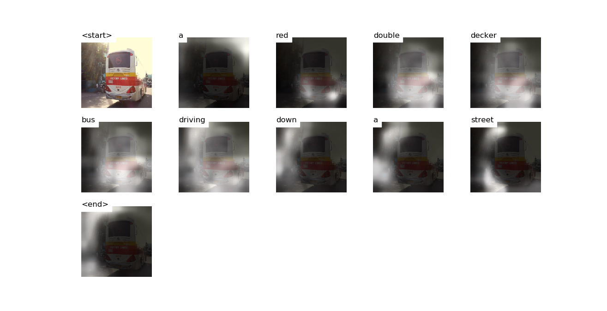

# Attention


# Decoding Beam (k=5)
```
['<start>', 'a'] 				 Score: -0.27497053146362305
['<start>', 'the'] 				 Score: -2.973459005355835
['<start>', 'two'] 				 Score: -3.027536392211914
['<start>', 'an'] 				 Score: -3.398942708969116
['<start>', 'there'] 				 Score: -3.9823973178863525


['<start>', 'a', 'double'] 				 Score: -1.2869362831115723
['<start>', 'a', 'red'] 				 Score: -1.5189242362976074
['<start>', 'a', 'bus'] 				 Score: -2.4316225051879883
['<start>', 'two', 'double'] 				 Score: -3.801590919494629
['<start>', 'the', 'double'] 				 Score: -3.8727147579193115


['<start>', 'a', 'double', 'decker'] 				 Score: -1.4363417625427246
['<start>', 'a', 'red', 'double'] 				 Score: -1.8217277526855469
['<start>', 'a', 'red', 'bus'] 				 Score: -3.853610038757324
['<start>', 'two', 'double', 'decker'] 				 Score: -3.9223413467407227
['<start>', 'the', 'double', 'decker'] 				 Score: -3.95621657371521


['<start>', 'a', 'double', 'decker', 'bus'] 				 Score: -1.5247974395751953
['<start>', 'a', 'red', 'double', 'decker'] 				 Score: -1.8478679656982422
['<start>', 'two', 'double', 'decker', 'buses'] 				 Score: -3.964031219482422
['<start>', 'the', 'double', 'decker', 'bus'] 				 Score: -4.012782096862793
['<start>', 'a', 'double', 'decker', 'red'] 				 Score: -5.156627178192139


['<start>', 'a', 'red', 'double', 'decker', 'bus'] 				 Score: -1.8812446594238281
['<start>', 'a', 'double', 'decker', 'bus', 'parked'] 				 Score: -3.262831449508667
['<start>', 'a', 'double', 'decker', 'bus', 'driving'] 				 Score: -3.327064037322998
['<start>', 'a', 'double', 'decker', 'bus', 'is'] 				 Score: -3.52052640914917
['<start>', 'a', 'double', 'decker', 'bus', 'on'] 				 Score: -3.9279839992523193


['<start>', 'a', 'red', 'double', 'decker', 'bus', 'driving'] 				 Score: -3.3859708309173584
['<start>', 'a', 'double', 'decker', 'bus', 'driving', 'down'] 				 Score: -3.653104305267334
['<start>', 'a', 'red', 'double', 'decker', 'bus', 'parked'] 				 Score: -3.7015819549560547
['<start>', 'a', 'red', 'double', 'decker', 'bus', 'on'] 				 Score: -4.134289741516113
['<start>', 'a', 'double', 'decker', 'bus', 'parked', 'on'] 				 Score: -4.195122718811035


['<start>', 'a', 'red', 'double', 'decker', 'bus', 'driving', 'down'] 				 Score: -3.733927011489868
['<start>', 'a', 'double', 'decker', 'bus', 'driving', 'down', 'a'] 				 Score: -4.0848469734191895
['<start>', 'a', 'red', 'double', 'decker', 'bus', 'on', 'a'] 				 Score: -4.688564300537109
['<start>', 'a', 'double', 'decker', 'bus', 'parked', 'on', 'the'] 				 Score: -4.711977958679199
['<start>', 'a', 'double', 'decker', 'bus', 'driving', 'down', 'the'] 				 Score: -4.7432098388671875


['<start>', 'a', 'red', 'double', 'decker', 'bus', 'driving', 'down', 'a'] 				 Score: -4.14881706237793
['<start>', 'a', 'double', 'decker', 'bus', 'driving', 'down', 'a', 'street'] 				 Score: -4.802258014678955
['<start>', 'a', 'red', 'double', 'decker', 'bus', 'driving', 'down', 'the'] 				 Score: -4.845460891723633
['<start>', 'a', 'double', 'decker', 'bus', 'parked', 'on', 'the', 'side'] 				 Score: -4.981142997741699
['<start>', 'a', 'double', 'decker', 'bus', 'driving', 'down', 'the', 'street'] 				 Score: -5.440650939941406


['<start>', 'a', 'red', 'double', 'decker', 'bus', 'driving', 'down', 'a', 'street'] 				 Score: -4.730983257293701
['<start>', 'a', 'double', 'decker', 'bus', 'parked', 'on', 'the', 'side', 'of'] 				 Score: -4.983142852783203
['<start>', 'a', 'double', 'decker', 'bus', 'driving', 'down', 'a', 'street', '<end>'] 				 Score: -5.271274566650391
['<start>', 'a', 'red', 'double', 'decker', 'bus', 'driving', 'down', 'the', 'street'] 				 Score: -5.465367317199707
['<start>', 'a', 'red', 'double', 'decker', 'bus', 'driving', 'down', 'a', 'road'] 				 Score: -5.535186767578125


['<start>', 'a', 'red', 'double', 'decker', 'bus', 'driving', 'down', 'a', 'street', '<end>'] 				 Score: -4.825098514556885
['<start>', 'a', 'double', 'decker', 'bus', 'parked', 'on', 'the', 'side', 'of', 'the'] 				 Score: -5.4112043380737305
['<start>', 'a', 'red', 'double', 'decker', 'bus', 'driving', 'down', 'the', 'street', '<end>'] 				 Score: -5.506451606750488
['<start>', 'a', 'red', 'double', 'decker', 'bus', 'driving', 'down', 'a', 'road', '<end>'] 				 Score: -5.640817642211914


['<start>', 'a', 'double', 'decker', 'bus', 'parked', 'on', 'the', 'side', 'of', 'the', 'road'] 				 Score: -5.6284637451171875


['<start>', 'a', 'double', 'decker', 'bus', 'parked', 'on', 'the', 'side', 'of', 'the', 'road', '<end>'] 				 Score: -5.702001094818115
```