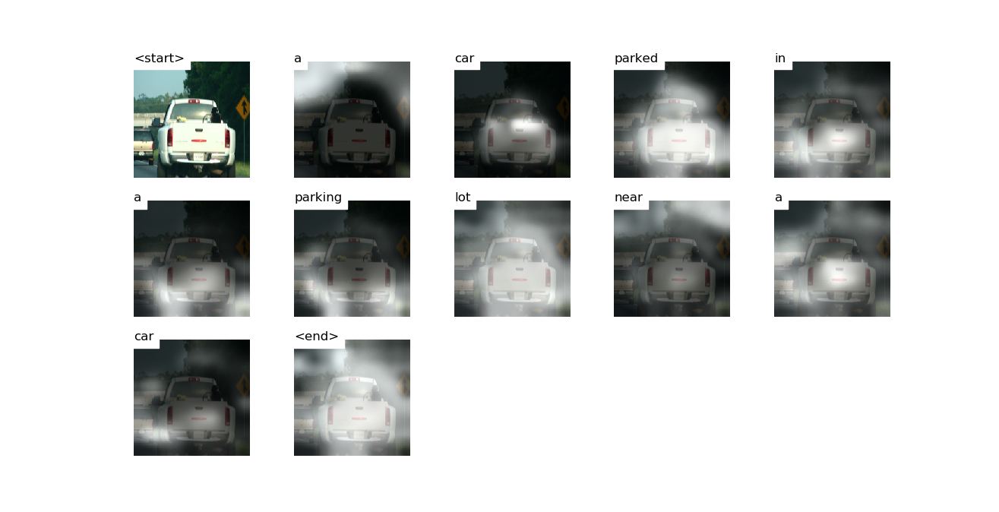

# Attention


# Decoding Beam (k=5)
```

['<start>', 'a'] 				 Score: -0.28165435791015625
['<start>', 'the'] 				 Score: -2.8755455017089844
['<start>', 'an'] 				 Score: -3.2942304611206055
['<start>', 'two'] 				 Score: -3.3380682468414307
['<start>', 'there'] 				 Score: -3.9284188747406006


['<start>', 'a', 'car'] 				 Score: -1.6505420207977295
['<start>', 'a', 'truck'] 				 Score: -2.770817756652832
['<start>', 'a', 'white'] 				 Score: -3.297119617462158
['<start>', 'a', 'red'] 				 Score: -3.5736770629882812
['<start>', 'a', 'large'] 				 Score: -3.654857635498047


['<start>', 'a', 'car', 'is'] 				 Score: -3.5234737396240234
['<start>', 'a', 'car', 'parked'] 				 Score: -3.631775379180908
['<start>', 'a', 'car', 'and'] 				 Score: -3.8536994457244873
['<start>', 'a', 'car', 'driving'] 				 Score: -3.9037888050079346
['<start>', 'a', 'car', 'with'] 				 Score: -4.273347854614258


['<start>', 'a', 'car', 'and', 'a'] 				 Score: -4.435148239135742
['<start>', 'a', 'car', 'driving', 'down'] 				 Score: -4.6905107498168945
['<start>', 'a', 'car', 'with', 'a'] 				 Score: -4.718957424163818
['<start>', 'a', 'car', 'is', 'parked'] 				 Score: -4.746916770935059
['<start>', 'a', 'car', 'parked', 'in'] 				 Score: -4.772520542144775


['<start>', 'a', 'car', 'driving', 'down', 'a'] 				 Score: -5.08750057220459
['<start>', 'a', 'car', 'parked', 'in', 'a'] 				 Score: -5.188168525695801
['<start>', 'a', 'car', 'is', 'parked', 'on'] 				 Score: -5.8927001953125
['<start>', 'a', 'car', 'driving', 'down', 'the'] 				 Score: -5.9424004554748535
['<start>', 'a', 'car', 'and', 'a', 'truck'] 				 Score: -5.983204364776611


['<start>', 'a', 'car', 'parked', 'in', 'a', 'parking'] 				 Score: -5.2688727378845215
['<start>', 'a', 'car', 'driving', 'down', 'a', 'street'] 				 Score: -6.005975723266602
['<start>', 'a', 'car', 'driving', 'down', 'a', 'road'] 				 Score: -6.166557312011719
['<start>', 'a', 'car', 'driving', 'down', 'the', 'road'] 				 Score: -6.397993564605713
['<start>', 'a', 'car', 'is', 'parked', 'on', 'a'] 				 Score: -6.519480228424072


['<start>', 'a', 'car', 'parked', 'in', 'a', 'parking', 'lot'] 				 Score: -5.492884159088135
['<start>', 'a', 'car', 'driving', 'down', 'a', 'street', 'with'] 				 Score: -6.914949893951416
['<start>', 'a', 'car', 'driving', 'down', 'a', 'road', 'with'] 				 Score: -7.04146671295166
['<start>', 'a', 'car', 'driving', 'down', 'the', 'road', 'with'] 				 Score: -7.254458427429199
['<start>', 'a', 'car', 'parked', 'in', 'a', 'parking', 'space'] 				 Score: -7.581430912017822


['<start>', 'a', 'car', 'parked', 'in', 'a', 'parking', 'lot', 'with'] 				 Score: -6.670397758483887
['<start>', 'a', 'car', 'parked', 'in', 'a', 'parking', 'lot', 'next'] 				 Score: -7.0861992835998535
['<start>', 'a', 'car', 'parked', 'in', 'a', 'parking', 'lot', 'near'] 				 Score: -7.377475738525391
['<start>', 'a', 'car', 'driving', 'down', 'a', 'street', 'with', 'a'] 				 Score: -7.593822956085205
['<start>', 'a', 'car', 'driving', 'down', 'a', 'road', 'with', 'a'] 				 Score: -7.799108505249023


['<start>', 'a', 'car', 'parked', 'in', 'a', 'parking', 'lot', 'next', 'to'] 				 Score: -7.087330341339111
['<start>', 'a', 'car', 'parked', 'in', 'a', 'parking', 'lot', 'with', 'a'] 				 Score: -7.390152931213379
['<start>', 'a', 'car', 'parked', 'in', 'a', 'parking', 'lot', 'near', 'a'] 				 Score: -7.768588066101074
['<start>', 'a', 'car', 'driving', 'down', 'a', 'street', 'with', 'a', 'red'] 				 Score: -9.446454048156738
['<start>', 'a', 'car', 'driving', 'down', 'a', 'street', 'with', 'a', 'traffic'] 				 Score: -9.722105979919434


['<start>', 'a', 'car', 'parked', 'in', 'a', 'parking', 'lot', 'next', 'to', 'a'] 				 Score: -7.326363563537598
['<start>', 'a', 'car', 'parked', 'in', 'a', 'parking', 'lot', 'with', 'a', 'car'] 				 Score: -9.641834259033203
['<start>', 'a', 'car', 'parked', 'in', 'a', 'parking', 'lot', 'with', 'a', 'red'] 				 Score: -9.647894859313965
['<start>', 'a', 'car', 'driving', 'down', 'a', 'street', 'with', 'a', 'traffic', 'light'] 				 Score: -9.785295486450195
['<start>', 'a', 'car', 'parked', 'in', 'a', 'parking', 'lot', 'near', 'a', 'car'] 				 Score: -10.027612686157227


['<start>', 'a', 'car', 'parked', 'in', 'a', 'parking', 'lot', 'next', 'to', 'a', 'parking'] 				 Score: -10.0469970703125
['<start>', 'a', 'car', 'parked', 'in', 'a', 'parking', 'lot', 'near', 'a', 'car', '<end>'] 				 Score: -10.210360527038574
['<start>', 'a', 'car', 'parked', 'in', 'a', 'parking', 'lot', 'next', 'to', 'a', 'car'] 				 Score: -10.23780632019043
['<start>', 'a', 'car', 'parked', 'in', 'a', 'parking', 'lot', 'next', 'to', 'a', 'parked'] 				 Score: -10.263896942138672
['<start>', 'a', 'car', 'driving', 'down', 'a', 'street', 'with', 'a', 'traffic', 'light', '<end>'] 				 Score: -10.338077545166016


['<start>', 'a', 'car', 'parked', 'in', 'a', 'parking', 'lot', 'next', 'to', 'a', 'car', '<end>'] 				 Score: -10.382894515991211
['<start>', 'a', 'car', 'parked', 'in', 'a', 'parking', 'lot', 'next', 'to', 'a', 'parking', 'lot'] 				 Score: -10.70654296875
['<start>', 'a', 'car', 'parked', 'in', 'a', 'parking', 'lot', 'next', 'to', 'a', 'parked', 'car'] 				 Score: -10.86014175415039


['<start>', 'a', 'car', 'parked', 'in', 'a', 'parking', 'lot', 'next', 'to', 'a', 'parking', 'lot', '<end>'] 				 Score: -10.882101058959961
['<start>', 'a', 'car', 'parked', 'in', 'a', 'parking', 'lot', 'next', 'to', 'a', 'parked', 'car', '<end>'] 				 Score: -10.909887313842773```