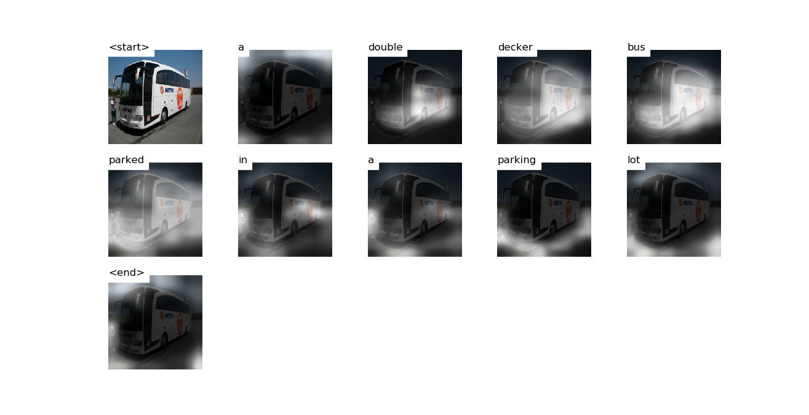

# Attention


# Decoding Beam (k=5)
```
['<start>', 'a'] 				 Score: -0.28055763244628906
['<start>', 'two'] 				 Score: -2.910029411315918
['<start>', 'the'] 				 Score: -3.0180892944335938
['<start>', 'an'] 				 Score: -3.1325836181640625
['<start>', 'there'] 				 Score: -4.03127908706665


['<start>', 'a', 'double'] 				 Score: -1.655092477798462
['<start>', 'a', 'bus'] 				 Score: -1.7008180618286133
['<start>', 'a', 'white'] 				 Score: -2.784438371658325
['<start>', 'a', 'large'] 				 Score: -2.8958213329315186
['<start>', 'an', 'old'] 				 Score: -3.8719868659973145


['<start>', 'a', 'double', 'decker'] 				 Score: -1.7807590961456299
['<start>', 'a', 'bus', 'is'] 				 Score: -3.2431812286376953
['<start>', 'a', 'bus', 'parked'] 				 Score: -3.2573225498199463
['<start>', 'a', 'white', 'bus'] 				 Score: -3.64582896232605
['<start>', 'a', 'bus', 'that'] 				 Score: -3.9011125564575195


['<start>', 'a', 'double', 'decker', 'bus'] 				 Score: -1.8703734874725342
['<start>', 'a', 'bus', 'is', 'parked'] 				 Score: -4.012692928314209
['<start>', 'a', 'bus', 'that', 'is'] 				 Score: -4.02573823928833
['<start>', 'a', 'bus', 'parked', 'on'] 				 Score: -4.386700630187988
['<start>', 'a', 'bus', 'parked', 'in'] 				 Score: -4.5964155197143555


['<start>', 'a', 'double', 'decker', 'bus', 'parked'] 				 Score: -3.349712610244751
['<start>', 'a', 'double', 'decker', 'bus', 'is'] 				 Score: -3.5242388248443604
['<start>', 'a', 'double', 'decker', 'bus', 'driving'] 				 Score: -4.068634986877441
['<start>', 'a', 'double', 'decker', 'bus', 'on'] 				 Score: -4.507396697998047
['<start>', 'a', 'bus', 'parked', 'on', 'the'] 				 Score: -4.79951286315918


['<start>', 'a', 'double', 'decker', 'bus', 'is', 'parked'] 				 Score: -4.288018226623535
['<start>', 'a', 'double', 'decker', 'bus', 'driving', 'down'] 				 Score: -4.505905628204346
['<start>', 'a', 'double', 'decker', 'bus', 'parked', 'on'] 				 Score: -4.516911506652832
['<start>', 'a', 'double', 'decker', 'bus', 'parked', 'in'] 				 Score: -4.537321090698242
['<start>', 'a', 'double', 'decker', 'bus', 'on', 'a'] 				 Score: -5.008681774139404


['<start>', 'a', 'double', 'decker', 'bus', 'parked', 'on', 'the'] 				 Score: -4.963995933532715
['<start>', 'a', 'double', 'decker', 'bus', 'parked', 'in', 'a'] 				 Score: -5.13278865814209
['<start>', 'a', 'double', 'decker', 'bus', 'driving', 'down', 'a'] 				 Score: -5.142903804779053
['<start>', 'a', 'double', 'decker', 'bus', 'driving', 'down', 'the'] 				 Score: -5.301386833190918
['<start>', 'a', 'double', 'decker', 'bus', 'is', 'parked', 'on'] 				 Score: -5.432157039642334


['<start>', 'a', 'double', 'decker', 'bus', 'parked', 'in', 'a', 'parking'] 				 Score: -5.304936408996582
['<start>', 'a', 'double', 'decker', 'bus', 'parked', 'on', 'the', 'side'] 				 Score: -5.484090328216553
['<start>', 'a', 'double', 'decker', 'bus', 'is', 'parked', 'on', 'the'] 				 Score: -5.656178951263428
['<start>', 'a', 'double', 'decker', 'bus', 'driving', 'down', 'a', 'street'] 				 Score: -5.888185024261475
['<start>', 'a', 'double', 'decker', 'bus', 'driving', 'down', 'the', 'road'] 				 Score: -5.993346214294434


['<start>', 'a', 'double', 'decker', 'bus', 'parked', 'in', 'a', 'parking', 'lot'] 				 Score: -5.345585823059082
['<start>', 'a', 'double', 'decker', 'bus', 'parked', 'on', 'the', 'side', 'of'] 				 Score: -5.490517616271973
['<start>', 'a', 'double', 'decker', 'bus', 'driving', 'down', 'the', 'road', '<end>'] 				 Score: -6.074607849121094
['<start>', 'a', 'double', 'decker', 'bus', 'driving', 'down', 'a', 'street', '<end>'] 				 Score: -6.09120512008667
['<start>', 'a', 'double', 'decker', 'bus', 'is', 'parked', 'on', 'the', 'street'] 				 Score: -6.741683483123779


['<start>', 'a', 'double', 'decker', 'bus', 'parked', 'in', 'a', 'parking', 'lot', '<end>'] 				 Score: -5.389482021331787
['<start>', 'a', 'double', 'decker', 'bus', 'parked', 'on', 'the', 'side', 'of', 'the'] 				 Score: -6.058000087738037
['<start>', 'a', 'double', 'decker', 'bus', 'parked', 'on', 'the', 'side', 'of', 'a'] 				 Score: -6.378569602966309


['<start>', 'a', 'double', 'decker', 'bus', 'parked', 'on', 'the', 'side', 'of', 'the', 'road'] 				 Score: -6.28812837600708
['<start>', 'a', 'double', 'decker', 'bus', 'parked', 'on', 'the', 'side', 'of', 'a', 'road'] 				 Score: -6.780543327331543


['<start>', 'a', 'double', 'decker', 'bus', 'parked', 'on', 'the', 'side', 'of', 'the', 'road', '<end>'] 				 Score: -6.328369140625
['<start>', 'a', 'double', 'decker', 'bus', 'parked', 'on', 'the', 'side', 'of', 'a', 'road', '<end>'] 				 Score: -6.821533203125
```