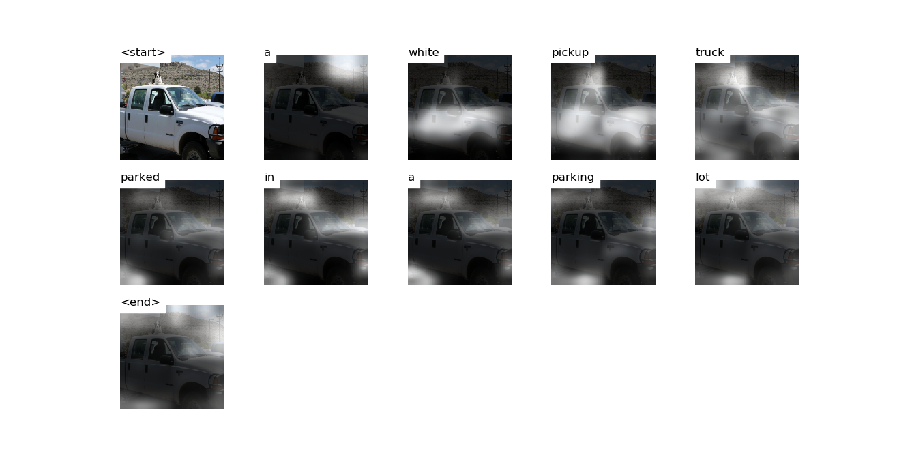

# Attention


# Decoding Beam (k=5)
```
['<start>', 'a'] 				 Score: -0.3025989532470703
['<start>', 'an'] 				 Score: -2.931119203567505
['<start>', 'the'] 				 Score: -2.983665943145752
['<start>', 'two'] 				 Score: -3.2247157096862793
['<start>', 'there'] 				 Score: -3.940157890319824


['<start>', 'a', 'truck'] 				 Score: -1.8110849857330322
['<start>', 'a', 'white'] 				 Score: -1.8841724395751953
['<start>', 'a', 'large'] 				 Score: -2.8950042724609375
['<start>', 'a', 'black'] 				 Score: -3.334385395050049
['<start>', 'an', 'old'] 				 Score: -3.4999916553497314


['<start>', 'a', 'white', 'truck'] 				 Score: -2.7888636589050293
['<start>', 'a', 'white', 'pickup'] 				 Score: -3.0277438163757324
['<start>', 'a', 'truck', 'with'] 				 Score: -3.210873603820801
['<start>', 'a', 'truck', 'parked'] 				 Score: -3.728618860244751
['<start>', 'a', 'truck', 'that'] 				 Score: -3.7857706546783447


['<start>', 'a', 'white', 'pickup', 'truck'] 				 Score: -3.0927062034606934
['<start>', 'a', 'truck', 'with', 'a'] 				 Score: -3.8076491355895996
['<start>', 'a', 'white', 'truck', 'with'] 				 Score: -3.8472232818603516
['<start>', 'a', 'truck', 'that', 'is'] 				 Score: -4.339447975158691
['<start>', 'a', 'white', 'truck', 'parked'] 				 Score: -4.505033493041992


['<start>', 'a', 'white', 'truck', 'with', 'a'] 				 Score: -4.146937370300293
['<start>', 'a', 'white', 'pickup', 'truck', 'with'] 				 Score: -4.243753910064697
['<start>', 'a', 'white', 'pickup', 'truck', 'parked'] 				 Score: -4.304342269897461
['<start>', 'a', 'white', 'truck', 'parked', 'in'] 				 Score: -5.409613132476807
['<start>', 'a', 'truck', 'that', 'is', 'sitting'] 				 Score: -5.491213321685791


['<start>', 'a', 'white', 'pickup', 'truck', 'with', 'a'] 				 Score: -4.5541205406188965
['<start>', 'a', 'white', 'pickup', 'truck', 'parked', 'in'] 				 Score: -5.1385345458984375
['<start>', 'a', 'white', 'truck', 'parked', 'in', 'a'] 				 Score: -5.79614782333374
['<start>', 'a', 'white', 'pickup', 'truck', 'parked', 'on'] 				 Score: -5.915521621704102
['<start>', 'a', 'truck', 'that', 'is', 'sitting', 'in'] 				 Score: -6.078184127807617


['<start>', 'a', 'white', 'pickup', 'truck', 'parked', 'in', 'a'] 				 Score: -5.748518466949463
['<start>', 'a', 'white', 'truck', 'parked', 'in', 'a', 'parking'] 				 Score: -6.013449668884277
['<start>', 'a', 'white', 'pickup', 'truck', 'parked', 'in', 'the'] 				 Score: -6.3039960861206055
['<start>', 'a', 'white', 'pickup', 'truck', 'with', 'a', 'dog'] 				 Score: -6.523567199707031
['<start>', 'a', 'truck', 'that', 'is', 'sitting', 'in', 'the'] 				 Score: -6.563906669616699


['<start>', 'a', 'white', 'pickup', 'truck', 'parked', 'in', 'a', 'parking'] 				 Score: -5.957063674926758
['<start>', 'a', 'white', 'truck', 'parked', 'in', 'a', 'parking', 'lot'] 				 Score: -6.298053741455078
['<start>', 'a', 'truck', 'that', 'is', 'sitting', 'in', 'the', 'back'] 				 Score: -7.227604389190674
['<start>', 'a', 'white', 'pickup', 'truck', 'parked', 'in', 'the', 'middle'] 				 Score: -7.778923511505127
['<start>', 'a', 'white', 'truck', 'parked', 'in', 'a', 'parking', 'space'] 				 Score: -7.875570774078369


['<start>', 'a', 'white', 'pickup', 'truck', 'parked', 'in', 'a', 'parking', 'lot'] 				 Score: -6.1474103927612305
['<start>', 'a', 'white', 'truck', 'parked', 'in', 'a', 'parking', 'lot', '<end>'] 				 Score: -6.5846123695373535
['<start>', 'a', 'truck', 'that', 'is', 'sitting', 'in', 'the', 'back', 'of'] 				 Score: -7.276953220367432
['<start>', 'a', 'white', 'pickup', 'truck', 'parked', 'in', 'the', 'middle', 'of'] 				 Score: -7.793208122253418
['<start>', 'a', 'white', 'pickup', 'truck', 'parked', 'in', 'a', 'parking', 'space'] 				 Score: -8.221563339233398


['<start>', 'a', 'white', 'pickup', 'truck', 'parked', 'in', 'a', 'parking', 'lot', '<end>'] 				 Score: -6.308202266693115
['<start>', 'a', 'truck', 'that', 'is', 'sitting', 'in', 'the', 'back', 'of', 'a'] 				 Score: -7.556825637817383
['<start>', 'a', 'white', 'pickup', 'truck', 'parked', 'in', 'the', 'middle', 'of', 'a'] 				 Score: -8.279617309570312
['<start>', 'a', 'white', 'pickup', 'truck', 'parked', 'in', 'a', 'parking', 'space', '<end>'] 				 Score: -8.490087509155273


['<start>', 'a', 'truck', 'that', 'is', 'sitting', 'in', 'the', 'back', 'of', 'a', 'truck'] 				 Score: -7.957135200500488
['<start>', 'a', 'white', 'pickup', 'truck', 'parked', 'in', 'the', 'middle', 'of', 'a', 'parking'] 				 Score: -9.007533073425293


['<start>', 'a', 'truck', 'that', 'is', 'sitting', 'in', 'the', 'back', 'of', 'a', 'truck', '<end>'] 				 Score: -7.976552486419678
['<start>', 'a', 'white', 'pickup', 'truck', 'parked', 'in', 'the', 'middle', 'of', 'a', 'parking', 'lot'] 				 Score: -9.014301300048828


['<start>', 'a', 'white', 'pickup', 'truck', 'parked', 'in', 'the', 'middle', 'of', 'a', 'parking', 'lot', '<end>'] 				 Score: -9.078187942504883
```